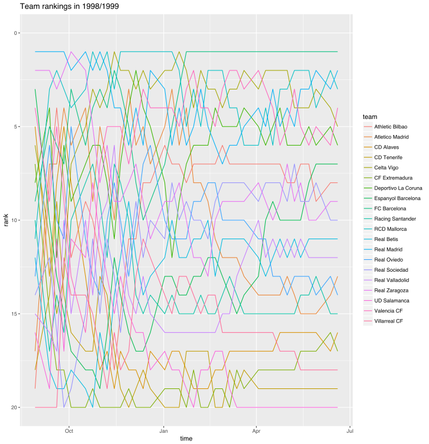
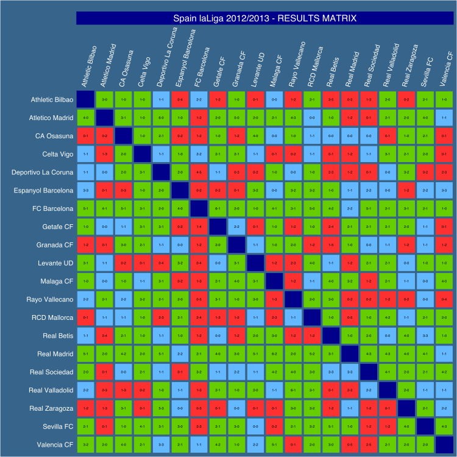

<div align="center">

</div>

<h1 dir="RTL"> 
تمرین سری سوم: از لالیگا تا لیگ برتر
</h1>

> <p dir="RTL"> 
با استفاده از داده های لیگ دسته اول اسپانیا به سوالات زیر پاسخ دهید.
از هر دو ابزار
ggplot2
و
highcharter
برای این کار تصویرسازی استفاده نمایید.
</p>

***
<p dir="RTL">

از آنجایی که برای حل سوالات نیاز به جدول لیگ در تمام سالها داریم، ابتدا بر اساس کد زیر جدول زیر را بدست میآوریم.
در این کد، برای هر فصل تعداد برد، مساوی و باخت هر تیم را بدست میآوریم و در نهایت امتیاز تیمها را محاسبه میکنیم.
همچنین لازم به ذکر است که برای نمایش تاریخ، فرمت را به فرمت 
Date
در 
R 
تبدیل میکنیم.
</p>

```{r, message=FALSE}
# making data and league table
library(devtools)
library(dplyr)
library(highcharter)
library(engsoccerdata)
library(ggplot2)

fdb = as.tbl(spain)

# creating all league table
laLiga <- fdb %>% filter(tier == 1)
laLiga$Date <- as.Date(laLiga$Date, format="%Y-%m-%d") 
#rbind two copies of the orignal df, simply reversing home/away team for each match
rbind(
  laLiga %>%
    select(Season, team = home, opp = visitor, GF = hgoal, GA = vgoal),
  laLiga %>%
    select(Season, team = visitor, opp = home, GF = vgoal, GA = hgoal)
) %>% mutate(GD = GF-GA) %>% 
  group_by(team,Season) %>% 
  summarize(GP = n(),
            goalsF = sum(GF),
            goalsA = sum(GA),
            goaldif = sum(GD),
            W = sum(GD > 0),
            D = sum(GD == 0),
            L = sum(GD < 0)
  ) %>% 
  mutate(score = W*3 + D) %>%
  arrange(Season, desc(score), desc(goaldif)) %>% 
  group_by(Season) %>% 
  mutate(rank = row_number() %>% as.integer()) -> atable
```

***

<p dir="RTL">
۱. تعداد قهرمانی های تیم ها در تاریخ لالیگا  را استخراج کرده و نمودار ستونی آنها را رسم کنید.
</p>
<p dir="RTL">
برای این نمودار ابتدا از جدول لیگ به ازای هر فصل، تیم دارای بیشترین امتیاز را انتخاب میکنیم، سپس بر اساس تیم گروهبندی کرده و تعداد رخداد هر تیم را محاسبه میکنیم.
</p>

```{r, message=FALSE, warning=FALSE}
champion_table <- atable %>% 
  group_by(Season) %>% filter(rank == 1)
champs <- champion_table %>% 
  group_by(team) %>% summarise(championships = n())

champs %>% 
  hchart(type = "column",hcaes(x = team, y = championships, color = championships)) %>% 
  hc_title(text = "Number of championships based on team", style = list(fontWeight = "bold")) %>% 
  hc_add_theme(hc_theme_sandsignika())

p1 = ggplot(data = champs, mapping = aes(x = team, y = championships, fill = championships)) + ggtitle("number of championships based on team") + geom_bar(stat="identity") + scale_fill_gradient(low="gold", high="darkgreen") + ylab("championship") + theme(axis.text.x = element_text(angle = 45, hjust = 1))
p1
```

***

<p dir="RTL">
۲. کسل کننده ترین لیگ و تیم را بیابید.
نمودار ده تیم و ده فصل کسل کننده را رسم کنید.
</p>
<p dir="RTL">
**کسلکنندهترین تیمها**
<br>
برای نمایش کسلکنندهترین تیمها معیاری را برای کسلکنندگی معرفی میکنیم که آن نسبت گلهای بازیهای تیمها به تعداد بازی تیمها است. سپس بر اساس تیم گروهبندی می کنیم و میانگین نسبت کسلکنندهگی تیمها را بدست آورده و ده تیم دارای کمترین مقدار را به عنوان کسلکنندهترین تیمها انتخاب میکنیم.
</p>

```{r, message=FALSE, warning=FALSE}
# average goal per game
atable <- atable %>% mutate(goaltotgame = (goalsA + goalsF)/GP)
boring_teams <- atable %>% 
  group_by(team) %>% summarise(goaltotavg = mean(goaltotgame)) %>% 
  arrange(goaltotavg) %>% slice(1:10)

highchart() %>% 
  hc_add_series(data = boring_teams, type = "line", hcaes(x = team, y = goaltotavg), name = "Boring teams", showInLegend = FALSE) %>% 
  hc_yAxis(title = list(text = "boring rate")) %>% 
  hc_xAxis(type = 'category', title = list(categories = boring_teams$team, text = "team")) %>% 
  hc_title(text = "Most boring teams", style = list(fontWeight = "bold")) %>%
  hc_add_theme(hc_theme_flat())

p_boring = ggplot(data = boring_teams, mapping = aes(y = goaltotavg, x = team, fill = goaltotavg)) + geom_bar(stat = "identity") + ggtitle('Most boring teams') + ylab("boring rate") + scale_fill_gradient(low="blue", high="red") + coord_flip()
p_boring
```

<p dir="RTL">
**کسلکنندهترین فصلها**
<br>
برای نمایش کسلکنندهترین فصلها، ابتدا معیاری برای کسلکنندگی تعریف میکنیم که برابر است با متوسط گل زدهشده در هر بازی. برای این منظور ابتدا تعداد گل بازیها را بدستآورده و سپس برای هر فصل متوسط تعداد گلزدهشده را مییابیم و در نهایت فصل هایی که دارای کمترین متوسط گل هستند را به عنوان کسلکنندهترین فصلها انتخاب میکنیم.
</p>
```{r, message=FALSE, warning=FALSE}
# average goal per game
laLiga <- laLiga %>% mutate(totgoal = hgoal + vgoal)
boring_seasons <- laLiga %>% 
  group_by(Season) %>% 
  summarise(avggoal = mean(totgoal)) %>% 
  arrange(avggoal) %>% 
  slice(1:10)
  
highchart() %>% 
  hc_add_series(data = boring_seasons, type = "line", hcaes(x = reorder(Season, avggoal), y = avggoal), name = "Boring seasons", showInLegend = FALSE, color = "lightseagreen") %>% 
  hc_yAxis(title = list(text = "boring rate")) %>% 
  hc_xAxis(type = 'category', title = list(categories = boring_seasons$Season, text = "season")) %>% 
  hc_title(text = "Most boring seasons", style = list(fontWeight = "bold")) %>%
  hc_add_theme(hc_theme_flat())

s_boring = ggplot(data = boring_seasons, mapping = aes(y = avggoal, x = Season, color = avggoal)) + geom_point(stat = "identity") + ggtitle('Most boring seasons') + ylab("boring rate") + scale_color_gradient(low="blue", high="red")
s_boring
```

***
<p dir="RTL">
برای حل سوالاتی که در ادامه میآیند، جدول نتایج جدیدی میسازیم که در آن برای هر بازی و هر تیم، دادههایی همچون تیم رقیب، گل زدهشده، گل خورده، تفاضل گل، تاریخ و فصل بازی را نگهداری میکنیم.
همچنین، جدول لیگ جدیدی میسازیم که در آن در هر فصل و برای هر تیم، دادههایی از قبیل شمارهی بازی، امتیاز تجمیعی تیم تا به این بازی، تعداد گل خوردهشدهی تجمیعی، تعداد گل زدهشدهی تجمیعی و اختلاف گل تجمیعی را محاسبه میکنیم.
سپس برای بدست آوردن هفتهی بازی، بر اساس شماره بازی و فصل گروهبندی کرده و هفتهی هر بازی را نیز بدست میآوریم، در نهایت این گروهبندی را حذف کرده و جدول نهایی را بر اساس تیم و فصل گروهبندی میکنیم.
<br>
برای محاسبهی حاصل تجمیعی از تابع
cumsum 
و برای محاسبهی شمارهی بازی بر اساس تاریخ از تابع
dense_rank 
بهره میبریم.
</p>
```{r, message=FALSE, warning=FALSE}
# full league results
res_table <- rbind(
  laLiga %>% mutate(team = home,
                    opponent = visitor,
                    GF = hgoal,
                    GA = vgoal,
                    GD = GF-GA) ,
  laLiga %>% mutate(team = visitor,
                    opponent = home, 
                    GF = vgoal,
                    GA = hgoal,
                    GD = GF-GA)
  ) %>% select(Date, Season, team, opponent, GF, GA, GD)

all_table <- res_table %>% group_by(Season, team) %>% 
  mutate(score = ifelse(GD > 0, 3, ifelse(GD < 0, 0, 1)),
         game_nu = dense_rank(Date),
         time = Date) %>% 
  arrange(Season, team, game_nu) %>% 
  mutate(score_cum = cumsum(score),
         GF_cum = cumsum(GF),
         GA_cum = cumsum(GA),
         GD_cum = cumsum(GD)
         ) %>% 
  select(Season, team, game_nu, time, score_cum, GF_cum, GA_cum, GD_cum)

all_table <- all_table %>% ungroup() %>% group_by(Season, game_nu) %>% 
  mutate(time = min(time)) %>% ungroup() %>% group_by(Season, team)
```

***

<p dir="RTL">
۳. در چند درصد موارد قهرمان نیم فصل در پایان فصل قهرمان شده است؟
</p>
<p dir="RTL">
برای حل این سوال از جدول لیگ جدیدی که در بالا ایجاد کردیم استفاده میکنیم، که برای محاسبهی نتایج پایان فصل، بر اساس بیشترین تعداد بازی فیلتر کرده و برای بدست آوردن نتایج نیمفصل بر اساس نصف بیشترین تعداد بازی فیلتر میکنیم. در نهایت بر حسب امتیاز تجمیعی ردهبندی کرده و تیمی که بیشترین امتیاز را داشته باشد را به عنوان قهرمان فصل اعلام میکنیم.
<br>
سپس قهرمانان نیمفصل و کل فصل را با یکدیگر بر اساس فصل
inner_join 
کرده و ستون دو تیم قهرمان نیمفصل و کل فصل را در هر فصل مقایسه میکنیم. در نهایت نسبت حاصل جمع این ستون، به تعداد فصلها درصد مورد نظر را به ما میدهد.
(در این سوال برای پیادهسازی روش رتبهبندی در لالیگا، در مواردی که تیم قهرمان با تیم دوم هر امتیاز بوده است، به صورت دستی و بر اساس معیار
head to head 
قهرمان انتخاب شدهاست.)
</p>
```{r, message=FALSE, warning=FALSE, comment=NA}
# full season results
full_season <- all_table %>% 
  filter(game_nu == max(game_nu)) %>% 
  arrange(Season, desc(score_cum), desc(GD_cum)) %>% 
  group_by(Season) %>%
  mutate(rank = row_number() %>% as.integer()) 

# champions in full season
full_champions <- full_season %>% filter(rank == 1)

  
# half season results
half_season <- all_table %>% 
  filter(game_nu == floor(max(game_nu)/2)) %>% 
  arrange(Season,desc(score_cum), desc(GD_cum)) %>% 
  group_by(Season) %>% 
  mutate(rank = row_number() %>% as.integer()) 

half_champions <- half_season %>% filter(rank == 1)

tot <- all_table %>% ungroup() %>% select(Season) %>% distinct() %>% nrow()

half_full <- inner_join(half_champions, full_champions, by = "Season")

half_full <- half_full %>% mutate(same = ifelse(team.x == team.y, 1, 0))

yes <- half_full %>% ungroup() %>%  summarise(sum(same))

res <- yes*100/tot

cat("only ", res[1]$sum, "percent of half season champions are full season champions.")
```

***

<p dir="RTL">
۴. در بین سال های ۲۰۰۱ تا ۲۰۱۰ گربه سیاه تیم های بزرگ چه تیم هایی بوده است؟
</p>

<p dir="RTL">
برای حل این سوال ابتدا تیمهای بزرگ و گربه سیاه را تعریف میکنیم. چهار تیم بزرگ عبارتند از:
<br>
بارسلونا، رئال مادرید، اتلتیک بیلبائو و والنسیا (این تیمها در طول این چند سال بیشترین قهرمانی و بیشترین امتیازات را داشتهاند.)
<br>
سپس گربه سیاه را تیمی تعریف میکنیم که رتبهاش از نیمهی جدول به پایین بوده و از طرفی با این تیمهای بزرگ یا مساوی کردهاست و یا باخته است.
<br>
برای حل این سوال از جدول لیگی که پیش از سوال ۳ آن را بدست آوردهایم استفاده میکنیم. برای بدست آوردن رتبهی هر تیم در هر هفته از بازیها، بر اساس فصل و شمارهی بازی گروهبندی میکنیم و سپس بر اساس بیشترین امتیاز و تفاضل گل، رتبهبندی تیمها را بدست میآوریم. 
<br>
سپس از جدول نتایجی که پیش از سوال ۳ بدست آوردهایم استفاده میکنیم، که برای بدست آوردن رتبهی تیم حریف، این جدول را با جدول امتیاز به ازای هر بازی تیمها
join 
میکنیم. سپس بازیهایی که تیمهای مورد نظر ما بازی کردهاند را انتخاب کرده و در هر فصل، بازیهایی که این تیمها باختهاند در حالی که حریف آنها در نیمهی جدول به پایین قرار داشته است را فیلتر میکنیم. در نهایت بر اساس تیمها و حریفانشان گروهبندی کرده و تیمهایی که بیشترین باخت را به آنها داشتهاند را به عنوان گربه سیاه تیمهای بزرگ معرفی میکنیم.
</p>

```{r, message=FALSE, warning=FALSE}
a_rank <- all_table %>% 
  group_by(Season, game_nu) %>% 
  arrange(desc(score_cum), desc(GD_cum)) %>% 
  mutate(rank = row_number() %>% as.integer())

res_table <- res_table %>% group_by(Season, team) %>% 
  mutate(score = ifelse(GD > 0, 3, ifelse(GD < 0, 0, 1)),
         game_nu = dense_rank(Date))

all_data <- res_table %>% inner_join(a_rank, by = c("Season", "game_nu", "opponent" = "team"))

interval <- all_data %>% filter(Season < 2011 & Season > 2000) %>% 
  filter(team == "Valencia CF" | team == "Real Madrid" | team == "Atletico Madrid" | team == "FC Barcelona") %>%
  ungroup %>% group_by(Season) %>% 
  filter(GD < 1) %>%
  filter(rank > round(max(rank)/2)) %>% 
  filter(opponent != "Valencia CF" & opponent != "Real Madrid" & opponent != "Atletico Madrid" & opponent != "FC Barcelona") %>% 
  ungroup() %>% group_by(team, opponent) %>% 
  summarise(lost = n()) %>% 
  ungroup() %>% group_by(team) %>% 
  filter(lost == max(lost))

interval %>% 
  hchart(type = "scatter", hcaes(x = opponent, y = lost, group = team)) %>% 
  hc_yAxis(title = list(text = "losts")) %>% 
  hc_xAxis(type = 'category', title = list(categories = interval$opponent, text = "opponent")) %>% 
  hc_title(text = "Best Four Teams Black Cats in 2001-2010", style = list(fontWeight = "bold")) %>% 
  hc_add_theme(hc_theme_darkunica())

p1 = ggplot(data = interval, mapping = aes(x = opponent, y = lost, color = team)) + ggtitle("Best Four Teams Black Cats in 2001-2010") + geom_point(stat="identity") + theme(axis.text.x = element_text(angle = 45, hjust = 1))
p1
```

***

<p dir="RTL">
۵. در تاریخ لالیگا کدام تیم رکورددار زودترین قهرمانی است؟
همچنین کدام تیم مقتدرانه ترین قهرمانی را داشته است؟
</p>

<p dir="RTL">
**زودترین قهرمانی**
<br>
برای حل این سوال از جدول لیگی که پیش از سوال ۳ آن را بدست آوردهایم استفاده میکنیم. برای بدست آوردن رتبهی هر تیم در هر هفته از بازیها، بر اساس فصل و شمارهی بازی گروهبندی میکنیم و سپس بر اساس بیشترین امتیاز و تفاضل گل، رتبهبندی تیمها را بدست میآوریم. 
<br>
حال برای بدست آوردن زودترین قهرمانی، تیمهای دارای رتبه یک و دو را در هفته فیلتر میکنیم، سپس این دو جدول را بر اساس فصل و شمارهی بازی
join 
کرده و ستون اختلاف امتیاز تیم اول و دوم را به این جدول اضافه میکنیم. سپس ستون بازی باقیمانده را برای هر فصل محاسبه میکنیم.
در نهایت در صورتی که اختلاف امتیاز از سه برابر بازیهای باقیمانده بیشتر باشد، پس این تیم حتما قهرمان شدهاست و تیم دوم دیگر نمیتواند به این تیم غلبه کند. حال درست بودن چنین فرضی را برای این تیمها محاسبه کرده و در نهایت تیمی که داری بیشترین بازی باقیمانده و ویژگی فوق باشد را به عنوان زودترین قهرمانی نمایش میدهیم.
</p>
```{r, message=FALSE, warning=FALSE, comment=NA}
# earliest championship
a_rank <- all_table %>% 
  group_by(Season, game_nu) %>% 
  arrange(desc(score_cum), desc(GD_cum)) %>% 
  mutate(rank = row_number() %>% as.integer())

first <- a_rank %>% group_by(Season, game_nu) %>% filter(rank == 1)
second <- a_rank %>% group_by(Season, game_nu) %>% filter(rank == 2)
first_sec <- first %>% inner_join(second, by = c("Season", "game_nu")) %>% 
  mutate(diff = score_cum.x - score_cum.y) %>% 
  select(Season = Season, game_nu = game_nu, team = team.x, diff = diff) %>% 
  ungroup() %>% group_by(Season) %>% 
  mutate(remaining_game = max(game_nu) - game_nu, is_win = ifelse(remaining_game*3 < diff, TRUE, FALSE)) %>% 
  filter(is_win == TRUE) %>% ungroup() %>% 
  filter(remaining_game == max(remaining_game)) %>% 
  select(Season = Season, Team = team, Game_Number = game_nu, Remaining_Game = remaining_game, Score_Difference = diff) %>% 
  arrange(-Score_Difference)
  
knitr::kable(first_sec)
```

<p dir="RTL">
**مقتدرانهترین قهرمانی**
<br>
برای حل این سوال، ابتدا معنی مقتدرانهترین قهرمانی را تعریف میکنیم که برابر است با بیشترین اختلاف قهرمان فصل با نایب قهرمان. حال از جدول
full_season 
که در سوال ۳ از آن استفاده شدهبود استفاده کرده و تیمهای رتبه یک و دو را انتخاب میکنیم. سپس این دو جدول را بر اساس فصل
join 
کرده و ستون اختلاف امتیاز تیم اول و دوم را محاسبه میکنیم.
در نهایت تیمی که دارای بیشترین اختلاف امیتاز است را به عنوات جواب نمایش میدهیم.
</p>

```{r, message=FALSE, warning=FALSE, comment=NA}
# most powerful championship in history
second <- full_season %>% filter(rank == 2)
first <- full_season %>% filter(rank == 1)
first_sec <- first %>% inner_join(second, by = "Season") %>% mutate(diff = score_cum.x - score_cum.y) %>% select(Season = Season, team = team.x, diff = diff)
powerful_champ <- first_sec %>% ungroup %>% filter(diff == max(diff))
cat('most powerful championship is:', powerful_champ[2]$team, " in ", powerful_champ[1]$Season, " with ", powerful_champ[3]$diff, "score difference.")

```

***

<p dir="RTL">
۶. طولانی ترین نوار پیروزی مساوی و شکست مال چه تیم هایی است؟
</p>
<p dir="RTL">
برای حل این سوال از جدول نتاجی که پیش از سوال ۳ تهیه کردیم استفاده میکنیم. به این صورت که این جدول را بر اساس تیم گروهبندی کرده و سپس بر اساس فصل و شمارهی بازی مرتب میکنیم. در نهایت کاراکترهای متوالی امتیاز بازی که نشان دهندهی برد یا مساوی یا باخت تیم است را میشماریم، که برای بدست آوردن بیشینه ی هر کدام از این مقادیر، بر اساس امتیاز دسته بندی کرده و تیمی که بیشترین امتیاز متوالی را داراست را انتخاب می کنیم.
</p>

```{r, message=FALSE, warning=FALSE}
longest_run <- res_table %>%
  ungroup() %>% group_by(team) %>% 
  arrange(Season, game_nu) %>%
  mutate(run = sequence(rle(as.character(score))$lengths)) %>% 
  group_by(score) %>% 
  filter(run == max(run)) %>% 
  arrange(-run) %>% 
  ungroup()
```
<p dir="RTL">
بیشترین برد متوالی:
</p>

```{r, message=FALSE, warning=FALSE}
knitr::kable(longest_run %>% 
               filter(score == 3) %>% 
               select(Season = Season, Team = team, Streak = run), "markdown")

```
<p dir="RTL">
بیشترین مساوی متوالی:
</p>

```{r, message=FALSE, warning=FALSE}
knitr::kable(longest_run %>% 
               filter(score == 1) %>% 
               select(Season = Season, Team = team, Streak = run), "markdown")

```
<p dir="RTL">
بیشترین باخت متوالی:
</p>

```{r, message=FALSE, warning=FALSE}
knitr::kable(longest_run %>% 
               filter(score == 0) %>% 
               select(Season = Season, Team = team, Streak = run))

```

***

<p dir="RTL">
۷. زودترین سقوط مال کدام تیم بوده است؟
</p>

<p dir="RTL">
برای بدستآوردن زودترین سقوط همانند زودترین قهرمانی عمل میکنیم، با این تفاوت که این بار، در صورتی که اختلاف امتیاز سه تیم آخر جدول با تیم چهارم از آخر بیشتر از سه برابر بازیهای باقیمانده باشد، سقوط این تیمها حتمی شدهاست.
<br>
برای بدستآوردن زودترین سقوط، تیمهای دارای رتبه آخر، یکی مانده به آخر، دو تا مانده به آخر و سه تا مانده به آخر را فیلتر میکنیم. سپس هر یک از جداول را  با جدول رتبهی سه تا مانده به آخر، بر اساس فصل و شمارهی بازی 
join 
کرده و ستون اختلاف امتیاز دو تیم را اضافه میکنیم. سپس ستون بازیهای باقیمانده را برای هر فصل محاسبه میکنیم. در نهایت تیمی که ویژگی زودترین سقوط را داشته باشد و بیشترین بازی باقیمانده را داشته باشد، زودترین سقوط تاریخ را رقم زدهاست.
</p>

```{r, message=FALSE, warning=FALSE}
# earliest downfall
last <- a_rank %>% group_by(Season, game_nu) %>% filter(rank == max(rank))
one_before_last <- a_rank %>% group_by(Season, game_nu) %>% filter(rank == max(rank) - 1)
two_before_last <- a_rank %>% group_by(Season, game_nu) %>% filter(rank == max(rank) - 2)
three_before_last <- a_rank %>% group_by(Season, game_nu) %>% filter(rank == max(rank) - 3)

last_fourth <- last %>% inner_join(three_before_last, by = c("Season", "game_nu")) %>% 
  mutate(diff = score_cum.y - score_cum.x) %>% 
  select(Season = Season, game_nu = game_nu, team = team.x, diff = diff) %>% 
  group_by(Season) %>% 
  mutate(remaining_game = max(game_nu) - game_nu, is_fall = ifelse(remaining_game*3 < diff, TRUE, FALSE)) %>% 
  filter(is_fall) %>% ungroup() %>% 
  filter(remaining_game == max(remaining_game)) %>% 
  select(Season = Season, Team = team, Game_Number = game_nu, Remaining_Game = remaining_game, Score_Difference = diff) %>% 
  arrange(-Score_Difference)

one_before_last_fourth <- one_before_last %>% inner_join(three_before_last, by = c("Season", "game_nu")) %>% 
  mutate(diff = score_cum.y - score_cum.x) %>% 
  select(Season = Season, game_nu = game_nu, team = team.x, diff = diff) %>% 
  group_by(Season) %>% 
  mutate(remaining_game = max(game_nu) - game_nu, is_fall = ifelse(remaining_game*3 < diff, TRUE, FALSE)) %>% 
  filter(is_fall) %>% ungroup() %>% 
  filter(remaining_game == max(remaining_game)) %>% 
  select(Season = Season, Team = team, Game_Number = game_nu, Remaining_Game = remaining_game, Score_Difference = diff) %>% 
  arrange(-Score_Difference)

falldown <- rbind(last_fourth, one_before_last_fourth)

two_before_last_fourth <- two_before_last %>% inner_join(three_before_last, by = c("Season", "game_nu")) %>% 
  mutate(diff = score_cum.y - score_cum.x) %>% 
  select(Season = Season, game_nu = game_nu, team = team.x, diff = diff) %>% 
  group_by(Season) %>% 
  mutate(remaining_game = max(game_nu) - game_nu, is_fall = ifelse(remaining_game*3 < diff, TRUE, FALSE)) %>% 
  filter(is_fall) %>% ungroup() %>% 
  filter(remaining_game == max(remaining_game)) %>% 
  select(Season = Season, Team = team, Game_Number = game_nu, Remaining_Game = remaining_game, Score_Difference = diff) %>% 
  arrange(-Score_Difference)

falldown <- rbind(falldown, two_before_last_fourth)

falldown <- falldown %>% filter(Remaining_Game == max(Remaining_Game))

knitr::kable(falldown)
```

***

<div align="center">

</div>

<p dir="RTL">
۸. مانند شکل بالا تصویری از روند تغییر رتبه تیم ها در طول فصل ۱۹۹۸ رسم نمایید.
</p>

<p dir="RTL">
برای این سوال از جدول به همراه رتبهبندی هفتگی تیمها در سوال ۵ استفاده میکنیم. در نتیجه تنها کافیست که فصل ۱۹۹۸ را انتخاب کرده و بر اساس هفتهی بازی جدول را مرتب کنیم.
</p>

```{r, message=FALSE, warning=FALSE}
rank_1998 <- a_rank %>% ungroup() %>% filter(Season == 1998) %>% arrange(time)

# team <- c("FCB", "RMA", "MLL", "VCF", "CEL", "RCD", "ESP", "ATH", "ZAR", "RSO", "BET", "VLD", "ATM", "ROV", "RAC", "ALV", "EXT", "VIL", "TEN", "SAL")
# rank <- c(1:20)
# team_names <- data.frame(team, rank)

rank_1998  %>% 
  hchart(type = "line", hcaes(x = datetime_to_timestamp(time), y = rank, group = team)) %>% 
  hc_yAxis(title = list(text = "Position"), reversed = TRUE, max = 20, tickInterval = 1, min = 1,
           plotLines = list(list(color = "#FF0000", width = 2, value = 10, dashStyle = 'shortdash'))
           ) %>% 
  hc_xAxis(type = "datetime", title = list(text = "date"), dateTimeLabelFormats = list(day = '%d of %b')) %>% 
  hc_title(text = "Team rankings in 1998/1999", style = list(fontWeight = "bold"))
```


```{r, message=FALSE, warning=FALSE, eval=FALSE}
ranking_1998 <- ggplot(data=rank_1998, aes(x= time, y=rank, colour=team)) + geom_line() + scale_y_reverse(limit=c(20,0)) + ggtitle("Team rankings in 1998/1999")
ranking_1998
```

<div align="center">

</div>
***

<div align="center">

</div>

<p dir="RTL">
۹. جدولی مشابه بالا برای فصل ۲۰۱۲ از  کل نتایج طراحی کنید.
</p>

```{r, message=FALSE, warning=FALSE, eval=FALSE}
league_2012 <- laLiga %>% filter(Season == 2012) %>% 
  select(home, visitor, FT, hgoal, vgoal) %>% 
  mutate(GD=hgoal-vgoal, result = ifelse(GD > 0, "H", ifelse(GD < 0, "A", "D")))

team_pos <- full_season %>% ungroup() %>% filter(Season == 2012) %>% 
  select(team, rank)

league_2012 <- league_2012 %>% left_join(team_pos, by = c("home" = "team"))

league_2012$home <- factor(league_2012$home, levels=rev(team_pos$team))
league_2012$visitor <- factor(league_2012$visitor, levels=team_pos$team)

league_2012$title <- "Spain laLiga 2012/2013 - RESULTS MATRIX"

matrix <- ggplot(league_2012, aes(visitor, home, fill = factor(result))) + 
  geom_tile(colour="steelblue4", size=1.5, stat="identity", height=1, width=1) + 
  geom_text(data=league_2012, aes(visitor, home, label = FT), color="black", size=rel(2)) +
  scale_x_discrete(expand = c(0, 0), position = "top") +
  scale_y_discrete(expand = c(0, 0)) +
  xlab("") + 
  ylab("") +
  facet_grid(. ~ title) +
  theme(
    strip.background = element_rect(fill="darkblue"),
    strip.text = element_text(size=15, colour="white"),
    strip.placement = "outside",
    panel.grid.major = element_blank(),
    panel.grid.minor = element_blank(),
    panel.border = element_rect(fill=NA,color="steelblue4", size=0.5, linetype="solid"),
    axis.line = element_blank(),
    axis.ticks = element_blank(), 
    axis.text = element_text(color="white", size=rel(1)),
    panel.background = element_rect(fill="darkblue"),
    plot.background = element_rect(fill="steelblue4"),
    legend.position = "none",
    axis.text.x  = element_text(angle=75, vjust=0.5, hjust=0)        
  ) 
matrix
```

<div align="center">

</div>
***

<p dir="RTL">
۱۰. سه آماره به همراه نمودار فردوسی پسند استخراج کنید.
</p>
<p dir="RTL">
**ضعیف ترین تیم های تاریخ لیگ اسپانیا**
<br>
برای دست آوردن ضعیف ترین تیم های تاریخ، ابتدا معیاری برای ضعیف بودن تیم تعریف می کنیم، که عبارت است از کسب کمترین امتیاز به ازای هر بازی. برای پیاده سازی این موضوع، تیم هایی که رتبه ی آخر را در هر فصل بدست آورده اند را انتخاب کرده و برای آن ها نسبت امتیاز کسب شده به کل امتیازهایی که می توان کسب کرد(۳ برابر تعداد بازی ها) را بدست میآوریم. در نهایت تیم هایی که دارای کمترین مقادیر هستند، ضعیف ترین تیم های تایرخ هستند.
</p>

```{r, message=FALSE, warning=FALSE}
###### 10 weakest teams of all time
weak <- full_season %>%
  filter(rank == max(rank)) %>% 
  mutate(score_rate = round(10*score_cum/(max(game_nu)*3))) %>% 
  ungroup %>% filter(score_rate == min(score_rate))

weak %>% 
  hchart(type = "column", hcaes(x = team, y = score_cum/10, group = Season)) %>% 
  hc_yAxis(title = list(text = "losts")) %>% 
  hc_xAxis(type = 'category', title = list(categories = weak$team, text = "opponent")) %>% 
  hc_title(text = "Weakest teams of all time", style = list(fontWeight = "bold")) %>% 
  hc_add_theme(hc_theme_darkunica())

weak_plot = ggplot(data = weak, mapping = aes(y = score_cum/10, x = team, fill = Season)) + geom_bar(stat="identity") + scale_fill_gradient(low="turquoise4", high="palegreen") + ggtitle("Weakest teams of all time") + ylab("score rate") + guides(color=guide_legend(title="season"), fill=guide_legend(title="season")) + theme(axis.text.x = element_text(angle = 45, hjust = 1)) 
weak_plot
```

***
<p dir="RTL">
**تاثیر نتیجه ی رتبه ی ۱۳ در سال های ۱۹۹۰ - ۱۹۹۹ در رتبه ی آینده ی تیم ها**
<br>
برای حل این سوال، به ازای هر سال بین ۱۹۹۰ تا ۱۹۹۹، تیمی که دارای رتبه ی ۱۳ شده است را بدست آورده و میانگین رتبه ی این تیم را به ازای فصل های بعدی بدست می آوریم.
<br>
نتیجه نشان می دهد که از بین نه تیم متمایز دارای رتبه ی سیزده در این ده سال، تنها دو تیم میانگین رتبه ی کمتر از ۱۰ داشته اند و نحسی عدد ۱۳ را بر روی آینده ی تیم ها نمایش می دهد.
</p>

```{r, message=FALSE, warning=FALSE}
###### 1990 rank 13 bad luck in 1991 - 2016
bad_luck <- full_season %>% 
  filter(Season == 1990) %>%
  filter(rank == 13)


what <- full_season %>% 
  filter(Season > 1990) %>% 
  filter(team == bad_luck$team) %>% 
  ungroup() %>% group_by(team) %>% 
  summarise(rank = round(mean(rank)))

destiny <- what

bad_luck <- full_season %>% 
  filter(Season == 1991) %>%
  filter(rank == 13)

what <- full_season %>% 
  filter(Season > 1991) %>% 
  filter(team == bad_luck$team) %>% 
  ungroup() %>% group_by(team) %>% 
  summarise(rank = round(mean(rank)))

destiny <- rbind(destiny, what)

bad_luck <- full_season %>% 
  filter(Season == 1992) %>%
  filter(rank == 13)

what <- full_season %>% 
  filter(Season > 1992) %>% 
  filter(team == bad_luck$team) %>% 
  ungroup() %>% group_by(team) %>% 
  summarise(rank = round(mean(rank)))

destiny <- rbind(destiny, what)

bad_luck <- full_season %>% 
  filter(Season == 1993) %>%
  filter(rank == 13)

what <- full_season %>% 
  filter(Season > 1993) %>% 
  filter(team == bad_luck$team) %>% 
  ungroup() %>% group_by(team) %>% 
  summarise(rank = round(mean(rank)))

destiny <- rbind(destiny, what)

bad_luck <- full_season %>% 
  filter(Season == 1994) %>%
  filter(rank == 13)

what <- full_season %>% 
  filter(Season > 1994) %>% 
  filter(team == bad_luck$team) %>% 
  ungroup() %>% group_by(team) %>% 
  summarise(rank = round(mean(rank)))

destiny <- rbind(destiny, what)

bad_luck <- full_season %>% 
  filter(Season == 1995) %>%
  filter(rank == 13)

what <- full_season %>% 
  filter(Season > 1995) %>% 
  filter(team == bad_luck$team) %>% 
  ungroup() %>% group_by(team) %>% 
  summarise(rank = round(mean(rank)))

destiny <- rbind(destiny, what)

bad_luck <- full_season %>% 
  filter(Season == 1996) %>%
  filter(rank == 13)

what <- full_season %>% 
  filter(Season > 1996) %>% 
  filter(team == bad_luck$team) %>% 
  ungroup() %>% group_by(team) %>% 
  summarise(rank = round(mean(rank)))

destiny <- rbind(destiny, what)

bad_luck <- full_season %>% 
  filter(Season == 1997) %>%
  filter(rank == 13)

what <- full_season %>% 
  filter(Season > 1997) %>% 
  filter(team == bad_luck$team) %>% 
  ungroup() %>% group_by(team) %>% 
  summarise(rank = round(mean(rank)))

destiny <- rbind(destiny, what)

bad_luck <- full_season %>% 
  filter(Season == 1998) %>%
  filter(rank == 13)

what <- full_season %>% 
  filter(Season > 1998) %>% 
  filter(team == bad_luck$team) %>% 
  ungroup() %>% group_by(team) %>% 
  summarise(rank = round(mean(rank)))

destiny <- rbind(destiny, what)

bad_luck <- full_season %>% 
  filter(Season == 1999) %>%
  filter(rank == 13)

what <- full_season %>% 
  filter(Season > 1999) %>% 
  filter(team == bad_luck$team) %>% 
  ungroup() %>% group_by(team) %>% 
  summarise(rank = round(mean(rank)))

destiny <- rbind(destiny, what)

destiny <- destiny %>% group_by(team) %>% 
  summarise(rank = round(mean(rank)))

destiny %>% 
  hchart(type = "column",hcaes(x = team, y = rank)) %>% 
  hc_title(text = "Influence of ranking 13 in team future!", style = list(fontWeight = "bold")) %>% 
  hc_add_theme(hc_theme_economist())

thirteen_plot = ggplot(data = destiny, mapping = aes(y = rank, x = team, fill = rank)) + geom_bar(stat="identity") + scale_fill_gradient(low="brown1", high="brown4") + ggtitle("Influence of ranking 13 in team future!") + ylab("average rank") + guides(color=guide_legend(title="average rank")) + theme(axis.text.x = element_text(angle = 45, hjust = 1)) 
thirteen_plot
```

***
<p dir="RTL">
**پر گل ترین دربی هر فصل کدام دربی بوده است؟**
<br>
دربی های مهم لالیگا عبارتند از:
<br>
ال کلاسیکو: بارسلونا - رئال مادرید
<br>
دربی مادرید: رئال مادرید - آتلتیکو مادرید
<br>
دربی باسلونا: بارسلونا - اسپانیول
<br>
دربی والنسیا: والنسیا - لوانته
<br>
برای حل این سوال، بازی های دربی بالا را فیلتر کرده و مجموع گل هر بازی را محاسبه می کنیم. هم چنین لیبلی برای هر جفت تیم های متمایز در دربی در نظر میگیریم تا دربی ها از یکدیگر متمایز شوند. در نهایت بر اساس فصل گروه بندی کرده و پر گل ترین بازی را نمایش می دهیم.
</p>
```{r, message=FALSE, warning=FALSE}
###### derby full results in years
derby <- res_table %>% 
  group_by(Season) %>% 
  filter((team == "Real Madrid" & opponent == "Atletico Madrid") |
           (team == "Atletico Madrid" & opponent == "Real Madrid") |
           (team == "Real Madrid" & opponent == "FC Barcelona") |
           (team == "FC Barcelona" & opponent == "Real Madrid") |
           (team == "FC Barcelona" & opponent == "Espanyol Barcelona") |
           (team == "Espanyol Barcelona" & opponent == "FC Barcelona") |
           (team == "Valencia CF" & opponent == "Levante UD") |
           (team == "Levante UD" & opponent == "Valencia CF")) %>% 
  mutate(allG = GA + GF) %>% 
  mutate(coler = ifelse((team == "Real Madrid" & opponent == "Atletico Madrid") |
                          (team == "Atletico Madrid" & opponent == "Real Madrid"),
                        "Madrid derby", 
                        ifelse((team == "Real Madrid" & opponent == "FC Barcelona") |
                                 (team == "FC Barcelona" & opponent == "Real Madrid"),
                               "El Clásico", ifelse((team == "FC Barcelona" & opponent == "Espanyol Barcelona") |
                                                      (team == "Espanyol Barcelona" & opponent == "FC Barcelona"), 
                                                    "Barcelona derby", ifelse((team == "Valencia CF" & opponent == "Levante UD") |
                                                                                (team == "Levante UD" & opponent == "Valencia CF")
                                                                              , "Valencia derby", NA))))) %>% 
  ungroup() %>% group_by(Season) %>% filter(allG == max(allG))


derby %>% 
  hchart(type = "column", hcaes(x = Season, y = allG, group = coler)) %>% 
  hc_yAxis(title = list(text = "average goal")) %>% 
  hc_xAxis(title = list(text = "season")) %>% 
  hc_title(text = "Derby goals in years", style = list(fontWeight = "bold"))

p = ggplot(data = derby, aes(y = allG, x = Season, color = coler, fill = coler)) + geom_bar(stat="identity", position = "dodge") + ggtitle("Derby goals in years") + xlab("season") + ylab("average goal") + guides(fill=guide_legend(title="derby"), color=guide_legend(title="derby"))
p
```

