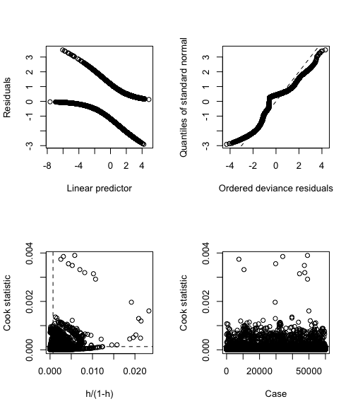

<div align="center">

</div>

> <p dir="RTL"> 
با توجه به سوالات مرگ و میر در آمریکا به سوالات زیر پاسخ دهید.
</p>

***

<p dir="RTL">
بارگزاری داده ها و کتابخانه ها:
</p>

```{r, message=FALSE, warning=FALSE, comment=NA}
library(readxl)
library(dplyr)

death = read.csv("data/murder_suicide.csv")
```

***

<p dir="RTL">
۱. از میان متغیرهای داده مرگ و میر یک زیرمجموعه ایی بدون حشو در نظر بگیرید.
ماتریس همبستگی متغیرهای مختلف را به دست آورده و سپس رسم نمایید. علاوه بر این نمودار پراکنش متغیرهای انتخاب شده را همزمان نسبت به هم رسم نمایید.
</p>

<p dir="RTL">
ابتدا داده هایی که عددی نیستند را تبدیل به عدد می کنیم. سپس داده های عددی را انتخاب می کنیم.
برای بدست آوردن متغیر های حشو، ابتدا ماتریس همبستگی متغیرها را رسم می کنیم و داده هایی که بیشترین همبستگی را با یکدیگر دارند، بررسی می کنیم. در دسته هایی که یک متغیر به روش های مختلف ارزیابی شده اند، هر بار یکی را قرار داده و متغیری که بیشترین هم بستگی را داشته باشد را انتخاب می کنیم. در نهایت نمودار همبستگی ما به صورت زیر می شود که مشاهده می کنیم داده ی حشو دیگر نداریم.
</p>

```{r, message=FALSE, warning=FALSE, comment=NA}
library(corrplot)

death_num <- death %>% mutate(Sex = factor(Sex) ) %>% 
  mutate(MannerOfDeath = ifelse(MannerOfDeath == 2, 1, 0)) %>% 
  mutate(InjuryAtWork = factor(InjuryAtWork)) %>% 
  mutate(MethodOfDisposition = factor(MethodOfDisposition)) %>% 
  mutate(MaritalStatus = factor(MaritalStatus))

all_cors = cor(data.matrix(death_num))
corrplot(all_cors, method = "color", tl.cex = 0.5/par("cex"), cl.cex = 0.5/par("cex"))


#### fixing education
death_num1989 <- death_num %>% filter(EducationReportingFlag == 0) %>% 
  mutate(edu = ifelse(Education1989Revision == 10, 2, ifelse(
    Education1989Revision == 11, 2, ifelse(
      Education1989Revision == 12, 3, ifelse(
        Education1989Revision == 13, 4, ifelse(
          Education1989Revision == 14, 5, ifelse(
            Education1989Revision == 15, 5, ifelse(
              Education1989Revision == 16, 6, ifelse(
                Education1989Revision == 17, 7, ifelse(
                  Education1989Revision == 99, 9, ifelse(
                    Education1989Revision == 9, 2, 1
                  )
                )
              )
            )
          )
        )
      )
    )))) %>% select(-EducationReportingFlag, -Education1989Revision, -Education2003Revision)

death_num2003 <- death_num %>% filter(EducationReportingFlag == 1) %>% 
  rename(edu = Education2003Revision) %>% select(-EducationReportingFlag, -Education1989Revision)

death_num2003$edu <- ifelse(death_num2003$edu == 8, 7, death_num2003$edu)

death_num <- rbind(death_num2003, death_num1989)

#### selecting data
death_num <- death_num %>% select(ResidentStatus, edu, MonthOfDeath, AgeRecode27, PlaceOfDeathAndDecedentsStatus, 
                                  DayOfWeekOfDeath, InjuryAtWork, MannerOfDeath, MethodOfDisposition, MaritalStatus,
                                  ActivityCode, PlaceOfInjury, Sex, RaceRecode3)
death_num_new <- death_num

all_cors = cor(data.matrix(death_num))
corrplot(all_cors, method = "color", tl.cex = 0.75/par("cex"), cl.cex = 0.75/par("cex"))
```

<p dir="RTL">
هم چنین میزان همبستگی متغیرها را با متغیر
MannerOfDeath
بدست می آوریم.
</p>

```{r, message=FALSE, warning=FALSE, comment=NA}
knitr::kable(sort(abs(all_cors['MannerOfDeath',]), decreasing = TRUE)[2:14])
```

<p dir="RTL">
از آنجایی که تعداد داده ها بسیار زیاد است و باعث کندی نمایش
scatterplotmatrix 
می شود، این نمودار را بر اساس تعداد کمتری از داده ها رسم می کینم.
نمودار پراکنش متغیرها نیز به شکل زیر است:
</p>

```{r, message=FALSE, warning=FALSE, comment=NA}
library(car)

death_num_sample = sample_n(death_num, 2000)
scatterplotMatrix(death_num_sample, spread=FALSE, smoother.args=list(lty=2), 
                  main="Scatter Plot Matrix of murder of suicide")
```

***

<p dir="RTL">
۲. اثر هر یک از متغیرهای جنسیت، نژاد،آموزش، سن و نحوه تدفین را بر مرگ یا خودکشی ارزیابی کنید.
</p>

<p dir="RTL">
با توجه به نوع داده ها(که دارای لول های مختلف هستند) از دو تست
correlation
و 
chi square test of independence
استفاده می کنیم.
</p>

```{r, message=FALSE, warning=FALSE, comment=NA}
death_mat <- data.matrix(death_num)

cor.test(death_mat[,"Sex"], death_mat[,"MannerOfDeath"], method = 'spearman')
chisq.test(death_num$Sex, death_num$MannerOfDeath)
```

<p dir="RTL">
بر اساس این دو تست مشاهده می کنیم که این دو متغیر با یکدیگر ارتباط داشته و از هم مستقل نیستند.
</p>

```{r, message=FALSE, warning=FALSE, comment=NA}
cor.test(death_mat [,"RaceRecode3"], death_mat [,"MannerOfDeath"], method = 'spearman')
chisq.test(death_num$RaceRecode3, death_num$MannerOfDeath)

```

<p dir="RTL">
بر اساس این دو تست مشاهده می کنیم که این دو متغیر با یکدیگر ارتباط داشته و از هم مستقل نیستند.
</p>

```{r, message=FALSE, warning=FALSE, comment=NA}
cor.test(death_mat [,"edu"], death_mat [,"MannerOfDeath"], method = 'spearman')
chisq.test(death_num$edu, death_num$MannerOfDeath)
```

<p dir="RTL">
بر اساس این دو تست مشاهده می کنیم که این دو متغیر با یکدیگر ارتباط داشته و از هم مستقل نیستند.
</p>

```{r, message=FALSE, warning=FALSE, comment=NA}
cor.test(death_mat [,"AgeRecode27"], death_mat [,"MannerOfDeath"], method = 'spearman')
chisq.test(death_num$AgeRecode27, death_num$MannerOfDeath)
```

<p dir="RTL">
بر اساس این دو تست مشاهده می کنیم که این دو متغیر با یکدیگر ارتباط داشته و از هم مستقل نیستند.
</p>

```{r, message=FALSE, warning=FALSE, comment=NA}
cor.test(death_mat [,"MethodOfDisposition"], death_mat [,"MannerOfDeath"], method = 'spearman')
chisq.test(death_num$MethodOfDisposition, death_num$MannerOfDeath)
```

<p dir="RTL">
بر اساس این دو تست مشاهده می کنیم که این دو متغیر با یکدیگر ارتباط داشته و از هم مستقل نیستند.
</p>

***

<p dir="RTL">
۳. با استفاده از مدل رگرسیون لاجستیک یک مدل به داده ها برازش دهید و سپس آن را نقص یابی کنید.
</p>

<p dir="RTL">
ابتدا مدل را برازش می دهیم و متغیرهایی که تاثیری در مدل ندارند را حذف می کنیم.
</p>

```{r, message=FALSE, warning=FALSE, comment=NA}
glm_model = glm(MannerOfDeath~., family = binomial(link = 'logit'), data = death_num)
summary(glm_model)
```

<p dir="RTL">
از آنجایی که دقت ما ۹۵ درصد است، متغیرهای 
MonthOfDeath
و 
DayOfWeekOfDeath 
را که 
significant 
نیستند، حذف می کنیم. سپس دو فاکتور غیرموثر در
MethodOfDisposition 
را نیز حذف می کنیم. در نهایت مدل را دوباره برازش می کنیم.
</p>

```{r, message=FALSE, warning=FALSE, comment=NA}
death_num <- death_num %>% select(-DayOfWeekOfDeath, -MonthOfDeath) %>% mutate(MethodOfDisposition = factor(MethodOfDisposition, exclude=c('E','R')))

glm_model = glm(MannerOfDeath~., family = binomial(link = 'logit'), data = death_num)
summary(glm_model)
glm_model_new = glm_model
```

<p dir="RTL">
در خروجی مدل مشاهده می کنیم که 
Null Deviance 
از
Residual Deviance
 بیشتر است و همچنین درجه آزادی آن نیز بیشتر است. پس مدل ما نسبت به مدلی که تنها
 intercept
 دارد بهتر عمل می کند. اما توزیع خطای مدل ما حول ۰.۵ است و انتظار خطای بالایی از مدل داریم.
</p>

```{r, message=FALSE, warning=FALSE, comment=NA, eval=FALSE}
library(boot)
glm.diag.plots(glm_model, glmdiag = glm.diag(glm_model))
```
<div align="center">

</div>

<p dir="RTL">
بر اساس نمودار بالا مشاهده می کنیم که خطای ما توزیع مناسبی حول صفر ندارد. از طرفی از آنجا که باقیمانده ها بر روی خط فیت نشده اند، مقدار واریانس نیز ثابت نیست. همچنین مشاهده می کنیم که دیتاهایی هستند که خارج از بازه ی 
cook 
بوده و باعث خراب شدن مدل شده اند و حذف این داده ها به بهبود مدل کمک می کند.
</p>

***

<p dir="RTL">
۴. با استفاده از سه نمودار خروجی مدل را نسبت به داده واقعی ارزیابی کنید.
</p>

```{r, message=FALSE, warning=FALSE, comment=NA}
death_num <- na.omit(death_num)

table(death_num$MannerOfDeath, ifelse(fitted(glm_model_new)>0.5,1,0)) %>% 
  plot(xlab = "prediction", ylab = "data") %>% 
  title(main = "GLM Perfomance: Real Value vs Predicted Value")
```
<p dir="RTL">
در این نمودار مشاهده می کنیم که تعداد داده هایی که درست(مثبت یا منقی) پیش بینی شده است از تعداد داده هایی که غلط پیش بینی شده اند بیشتر است. اما میزان خطای مدل ما کم نیست.
</p>


```{r, message=FALSE, warning=FALSE, comment=NA}
library(ggplot2)
library(ggthemes)

death_num_pred = death_num %>% mutate(preds = predict(glm_model, type = 'response'))
ggplot( death_num_pred, aes( preds, color = as.factor(MannerOfDeath))) + 
  geom_density( size = 1 ) +
  ggtitle( "Training Set's Predicted Score" ) + 
  scale_color_economist( name = "Manner of Death", labels = c( "suicide", "death" ) )
```
<p dir="RTL">
در این نمودار مشاهده می کنیم که تقریبا بیشترین تراکم داده در هر گروه نزدیک به احتمال آن گروه قرار دارد، اما میزان همپوشانی دو نمودار زیاد است که این موضوع نشان دهنده ی خطای مدل ما می باشد.
</p>

<p dir="RTL">
برای بخش نمایش نمودار این سوال و سه سوال بعدی از فایل
unbalanced_functions
استفاده می شود.
</p>

```{r, message=FALSE, warning=FALSE, comment=NA}
source(file = "codes/unbalanced_functions.R")

cm_info = ConfusionMatrixInfo( data = death_num_pred, predict = "preds", 
                               actual = "MannerOfDeath", cutoff = 0.5 )
cm_info$plot
```
<p dir="RTL">
در نمودار بالا مشاهده می کنیم که تعداد مقادیر درست پیش بینی شده، از مقادیر اشتباه بیشتر است، اما تعداد پیش بینی های اشتباه بسیار زیاد است که نشان می دهد که دقت مدل ما خیلی بالا نیست. از طرفی مقادیر پیش بینی شده نیست، عموما احتمالی نزدیک ۱ یا ۰ ندارند که این موضوع نیز باعث می شود که انتخاب مقادیر 
cutoff 
در دقت ما بسیار تاثیر داشته باشد و انتخاب
cutoff 
دشوار شود.
</p>

***

<p dir="RTL">
۵. ابتدا ۲۰ درصد داده را به صورت تصادفی به عنوان تست در نظر بگیرید. مدل را با استفاده از ۸۰ درصد باقی مانده برازش دهید. با استفاده از پارامتر قطع ۰.۵ نتایج را برای داده تست پیش بینی کنید. سپس کمیت های زیر را محاسبه کنید.
</p>

* P: positive samples
* N: negative samples
* TP: true positive TP (eqv. with hit)
* TN: true negative (eqv. with correct rejection)
* FP: false positive (eqv. with false alarm, Type I error)
* FN: false negative (eqv. with miss, Type II error)
* Accuracy (ACC) ACC = (TP+TN)/(P+T)
* False positive rate (FPR): 1- TN/N
* True positive rate (TPR): TP/P

<p dir="RTL">
مشابه آنچه در کلاس گفته شد نمایشی از  چهار کمیت 
TN, TP,FP,FN
به همراه داده ها رسم نمایید.
</p>

```{r, message=FALSE, warning=FALSE, comment=NA}
index = sample(x= 1:nrow(death_num),size = round(0.8*nrow(death_num)),replace = F)
train = death_num[index,] 
train <- na.omit(train)

test =  death_num[-index,]
test <- na.omit(test)

glm_model = glm(MannerOfDeath~., family = binomial(link = 'logit'), data = train)

train$prediction  = predict(glm_model, newdata = train, type = "response")
test$prediction  = predict(glm_model, newdata = test, type = "response")
cutoff = 0.5
train <- train %>% mutate(get = ifelse(prediction < cutoff, 0, 1))
test <- test %>% mutate(get = ifelse(prediction < cutoff, 0, 1))

P <- test %>% filter(MannerOfDeath == 1) %>% nrow()
cat("P: ", P)

N <- test %>% filter(MannerOfDeath == 0) %>% nrow()
cat("N: ", N)

TP <- test %>% filter(MannerOfDeath == 1 & get == 1) %>% nrow()
cat("TP: ", TP)

TN <- test %>% filter(MannerOfDeath == 0 & get == 0) %>% nrow()
cat("TN: ", TN)

FP <- test %>% filter(MannerOfDeath == 0 & get == 1) %>% nrow()
cat("FP: ", FP)

FN <- test %>% filter(MannerOfDeath == 1 & get == 0) %>% nrow()
cat("FN: ", FN)

ACC <- (TP + TN)/(P + N)
cat("Accuracy: ", ACC)

FPR <- 1 - (TN/N)
cat("False Positive Rate: ", FPR)

TPR <- TP/P
cat("True Positive Rate: ", TPR)

cm_info = ConfusionMatrixInfo( data = test, predict = "prediction", 
                               actual = "MannerOfDeath", cutoff = cutoff )
cm_info$plot
```

<p dir="RTL">
در نمودار بالا مشاهده می کنیم که تعداد مقادیر درست پیش بینی شده، از مقادیر اشتباه بیشتر است، اما تعداد پیش بینی های اشتباه بسیار زیاد است که نشان می دهد که دقت مدل ما خیلی بالا نیست. از طرفی مقادیر پیش بینی شده نیست، عموما احتمالی نزدیک ۱ یا ۰ ندارند که این موضوع نیز باعث می شود که انتخاب مقادیر 
cutoff 
در دقت ما بسیار تاثیر داشته باشد و انتخاب
cutoff 
دشوار شود.
</p>
***

<p dir="RTL">
۶. نمودار صحت مدل (accuracy) را بر حسب مقادیر مختلف قطع برای داده تست رسم نمایید. کدام پارامتر قطع بالاترین صحت را در پیش بینی داراست؟
</p>

```{r, message=FALSE, warning=FALSE, comment=NA}
accuracy_info = AccuracyCutoffInfo( train = train, test = test, 
                                    predict = "prediction", actual = "MannerOfDeath" )
accuracy_info$plot
accuracy_info$max_acc$accuracy

cat("maximum accuracy is:", accuracy_info$max_acc$accuracy, " with cutoff:", accuracy_info$max_acc$cutoff)
```

<p dir="RTL">
همانطور که مشاهده می کنیم پارامتر قطع ۰.۴۲ بیشترین صحت را داراست.
</p>

***

<p dir="RTL">
۷. نمودار 
ROC
 را برای داده های قسمت قبل رسم نمایید. همچنین نقطه مربوط به بهترین پارامتر قطع را مشخص نمایید.
</p>

```{r, message=FALSE, warning=FALSE, comment=NA}
cost_fp = 100
cost_fn = 200
roc_info = ROCInfo( data = cm_info$data, predict = "predict", 
                    actual = "actual", cost.fp = cost_fp, cost.fn = cost_fn )
plot(roc_info$plot)
cat("optimal cutoff value:", roc_info$cutoff, "and the corresponding true positive rate:",  roc_info$sensitivity, "and false positive rate:", 1 - roc_info$specificity)

```

<p dir="RTL">
همانطور که در نمودار می بینیم، بهترین مقدار
cutoff
۰.۳۱ است که در آن مقدار
sensitivity 
۰.۹۶ بوده و مقدار
specificity 
نیز ۰.۴۵ است.
</p>

***

<p dir="RTL">
۸. با قرار دادن کمیت 
nfolds = 5
و با استفاده از 
H20
مدل مساله را بسازید و نتیجه حاصل را ارزیابی کنید.
</p>

<p dir="RTL">
در این مدل از داده هایی که بی تاثیر بودن آن ها را بدست آورده بودیم، استفاده نمی کنیم.
</p>

```{r, message=FALSE, warning=FALSE, comment=NA}
library(h2o)

h2o.init()

y <- "MannerOfDeath"
x <- c("ResidentStatus", "edu", "AgeRecode27", "PlaceOfDeathAndDecedentsStatus", 
       "InjuryAtWork", "MannerOfDeath", "MethodOfDisposition", "MaritalStatus",
       "ActivityCode", "PlaceOfInjury", "Sex", "RaceRecode3")

h_death_num <- as.h2o(death_num)

hglm = h2o.glm(y = y, x = x,
                training_frame = h_death_num, family="binomial", link = "logit", lambda = 0,
               compute_p_values = TRUE, nfolds = 5)
hglm
```

<p dir="RTL">
ابتدا در خروجی ضرایب مدل مشاهده می کنیم که هیچ متغیری که با دقت ۹۵ درصدی ما بدون تاثیر باشد، وجود ندارد. مشاهده می کنیم که دقت ما حدود ۸۴ درصد شده است که مقدار 
glm
بیشتر شده است. همچنین مقدار 
recall 
نیز که میزان خودکشی هایی است که ما خودکشی حدس زده ایم نیز بیشتر شده است و برابر با ۹۰ درصد است. اما تعداد قتل هایی که آن ها را خودکشی تشخیص دادیم تنها حدود ۵۰ درصد است. هم چنین میانگین خطای ما از
glm 
کمتر شده است.
</p>

***

<p dir="RTL"> 
۹. آیا ما میتوانیم سرویسی به قضات ارایه کنیم تا با استفاده از اطلاعات مرگ بتوانند موارد مشکوک به قتل را از خودکشی تفکیک دهند؟
</p>

<p dir="RTL">
خیر، زیرا همانطور که در مدل بالا دیدیم، میزان خطای این مدل ها کم نیست. از طرفی در مدل بالا می توانیم با دقت بالایی خودکشی هایی که واقعا خودکشی بوده اند را پیشبینی کنیم، اما دقت ما در مواردی که قتل بوده است اما خودکشی پیشبینی شده است بسیار کم است. به همین دلیل این روش (حداقل با این دقت) برای قضاوت گزینه ی مناسبی نیست.
از طرفی این پیشبینی ها نوسان دارند، به طوری که دقت ما همواره مقدار ثابتی نیست و این موضوع نیز بر روی عدم اطمینان به این موضوع صحه می گذارد.
</p>
