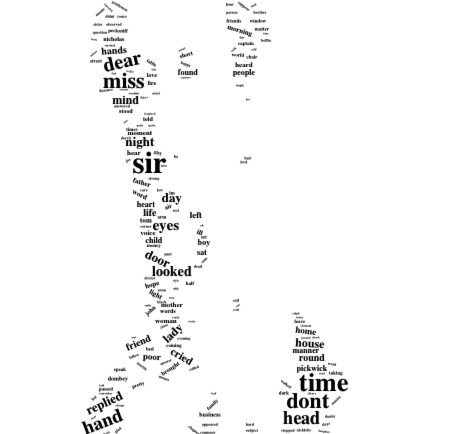
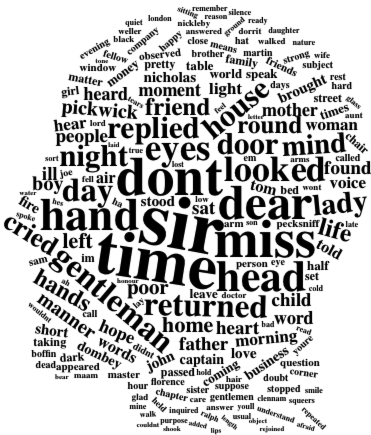
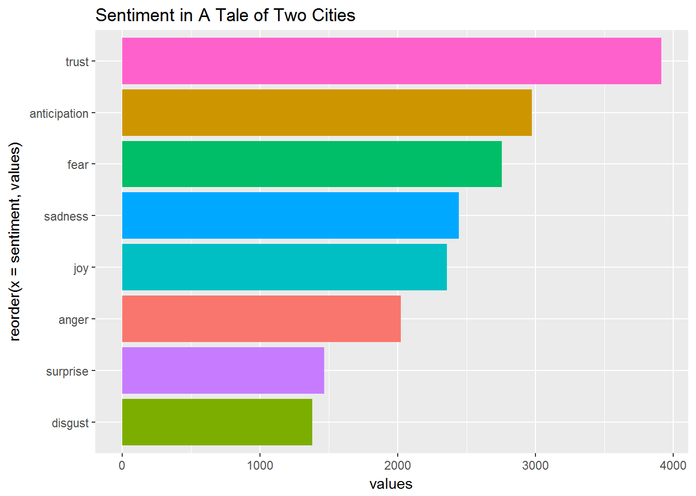

<div align="center">

</div>

> <p dir="RTL"> 
با استفاده از بسته gutenberg داده های لازم را به دست آورید و به سوالات زیر پاسخ دهید.
</p>

***
<p dir="RTL">
بارگزاری داده ها و کتابخانه ها:
</p>

```{r, message=FALSE, warning=FALSE, comment=NA}
library(gutenbergr)
library(tidyverse)
library(stringr)
library(tidytext)
```

***

<p dir="RTL">
۱. چارلز دیکنز نویسنده معروف انگلیسی بالغ بر چهارده رمان (چهارده و نیم) نوشته است. متن تمامی کتاب های او را دانلود کنید و سپس بیست لغت برتر استفاده شده را به صورت یک نمودار ستونی نمایش دهید. (طبیعتا باید ابتدا متن را پاکسازی کرده و stopping words را حذف نمایید تا به کلماتی که بار معنایی مشخصی منتقل می کنند برسید.)
</p>

<p dir="RTL">
ابتدا تمامی کتاب های چارلز دیکنز را با کمک
gutenberg 
بدست می آوریم. سپس ۱۵ رمان برتر نویسنده را انتخاب می کنیم. سپس تک تک کتاب را دانلود کرده و آن ها را در 
book_texts 
ذخیره می کنیم. (در سایر بخش های تمرین از این داده برای تحلیل متن بهره می بریم.)
</p>

```{r, message=FALSE, warning=FALSE, comment=NA}
library(highcharter)

dickens_list <- gutenberg_works(author == "Dickens, Charles")
dickens_list <- dickens_list[c(2, 3, 4, 12, 13, 14, 15, 19, 23, 27, 32, 33, 34, 35, 39), ]
dickens_list <- dickens_list %>% select(gutenberg_id, title)
```

```{r, message=FALSE, warning=FALSE, comment=NA, eval=FALSE}
books_texts = list()

# downloading all books
for( i in 1:nrow(dickens_list)){
  book = gutenberg_download(dickens_list[i, 1, 1])
  books_texts[[i]] = book
}
saveRDS(books_texts, file="data/booktext.rds")
```

<p dir="RTL">
برای بدست آوردن کلماتی که بیشترین تکرار را داشته اند، ابتدا تمامی متن را به 
lowercase 
تبدیل می کنیم. سپس نشانه گذاری را حذف می کنیم و متن را به کلمات آن تقسیم می کنیم. سپس فرآیند فوق را به ازای تمامی رمان ها انجام داده و همه را در یک دیتا فریم قرار می دهیم. در نهایت از این دیتا 
stopwords،
اعداد و تک حرف را حذف می کنیم. در نهایت تکرار کلمات را بدست می آوریم.
</p>

```{r, message=FALSE, warning=FALSE, comment=NA}
books_texts = readRDS(file="data/booktext.rds")
# using books
all_books = list()
for( i in 1:nrow(dickens_list)){
  book = books_texts[[i]]
  wbook = book %>% mutate(text = str_to_lower(text)) %>% 
    select(text) %>% 
    str_replace_all("\"","") %>% 
    str_replace_all("[[:punct:]]","") %>% str_split(pattern = "\\s") %>% 
    unlist() %>% as.data.frame(stringsAsFactors = F)
    if(i == 1){
      all_books = wbook
    } else {
      all_books = bind_rows(all_books, wbook)
    }
}  
  

all_books <- all_books %>% table() %>% 
  as.data.frame(stringsAsFactors = F)
  
colnames(all_books) = c("word","count")

all_books <- all_books %>%
    filter(!word %in% stop_words$word) %>% 
    filter(str_length(word)>1) %>% 
    filter(!str_detect(word,"\\d")) %>%
    arrange(desc(count))

top_words <- all_books %>% slice(1:20)

top_words %>% 
  hchart(type = "column",hcaes(x = word, y = count, color = count)) %>% 
  hc_title(text = "Most repeated words", style = list(fontWeight = "bold")) %>% 
  hc_add_theme(hc_theme_sandsignika())
```


***

<p dir="RTL">
۲. ابر لغات ۲۰۰ کلمه پرتکرار در رمان های چارلز دیکنز را رسم نمایید. این کار را با بسته wordcloud2 انجام دهید. برای دانلود می توانید به لینک زیر مراجعه کنید.
</p>

https://github.com/Lchiffon/wordcloud2

<p dir="RTL">
 با استفاده از عکسی که در ابتدا متن آمده ابر لغاتی مانند شکل زیر رسم کنید. (راهنمایی: از ورودی figpath در دستور wordcloud2 استفاده نمایید.مثالی در زیر آورده شده است.)
</p>

<div align="center">

</div>

<p dir="RTL">
ابتدا بسته ی 
wordcloud2 
را نصب می کنیم، سپس سعی می کنیم که ابرلغات را رسم کنیم.
</p>

```{r, message=FALSE, warning=FALSE, comment=NA, eval=FALSE}
library(wordcloud2)

word_fig <- all_books %>% slice(1:200) %>% select(word, freq = count)

wordcloud2(word_fig , figPath = "images/dickens1_1.png" , size = 0.17, color = "black")
```
<div align="center">

</div>

<p dir="RTL">
از آنجایی که ابرلغات بالا واضح نبود، ابر لغاتی به شکل صورت انسان نیز در ادامه آمده است.
</p>
<div align="center">

</div>


***

<p dir="RTL">
۳. اسم پنج شخصیت اصلی در هر رمان دیکنز را استخراج کنید و با نموداری تعداد دفعات تکرار شده بر حسب رمان را رسم نمایید. (مانند مثال کلاس در رسم اسامی شخصیت ها در سری هر پاتر)
</p>

<p dir="RTL">
برای بدست آوردن شخصیت ها، ابتدا نشانه گذاری ها را از متن کتاب حذف کرده و سپس آن را تبدیل به کلمات می کنیم. سپس 
stopwords، 
اعداد، تک حرف، کلماتی که با حرف کوچک شروع می شوند و کلماتی که هم با حروف بزرگ و هم حروف کوچک قرار دارند را حدف می کنیم. سپس فرآیند فوق را به ازای تمامی رمان ها انجام می دهیم. سپس ۵ شخصیت پرتکرار هر کتاب را که بیشترین درصد حضور در متن را دارند را به عنوان شخصیت اصلی قرار می دهیم.
</p>

```{r, message=FALSE, warning=FALSE, comment=NA}
library(highcharter)

character_list = list()
for( i in 1:nrow(dickens_list)){
  book = books_texts[[i]]
  wbook = book %>% 
    str_replace_all("\"","") %>% 
    str_replace_all("[[:punct:]]","") %>% 
    str_split(pattern = "\\s") %>% 
    unlist() %>% 
    table() %>% 
    as.data.frame(stringsAsFactors = F)
  
  colnames(wbook) = c("word","count")
  wbook = wbook %>%
    filter(!str_to_lower(word) %in% stop_words$word) %>% 
    filter(str_length(word)>1) %>% 
    filter(!str_detect(word,"\\d")) %>%
    arrange(desc(count)) %>% 
    mutate(proper = !word %in% str_to_lower(word)) %>% 
    mutate(Book = dickens_list[i,2,1]) %>% 
    filter(proper == TRUE)
  character_list[[i]] = wbook
}

characters = bind_rows(character_list)
    
top_characters <- characters %>% 
  group_by(Book) %>% 
  mutate(percent = round(100*count/sum(count))) %>% 
  arrange(desc(percent)) %>% 
  mutate(rank = row_number() %>% as.integer()) %>% 
  filter(rank < 6) %>%
  rename(name = word)

top_characters %>% 
  hchart("column", hcaes(x = Book, y = percent, group = name)) %>% 
  hc_add_theme(hc_theme_google())
```

***

<p dir="RTL">
۴.  در بسته tidytext داده ایی به نام sentiments وجود دارد که فضای احساسی لغات را مشخص می نماید. با استفاده از این داده نمودار ۲۰ لغت برتر negative و ۲۰ لغت برتر positive را در کنار هم رسم نمایید. با استفاده از این نمودار فضای حاکم بر داستان چگونه ارزیابی می کنید؟ (به طور مثال برای کتاب داستان دو شهر فضای احساسی داستان به ترتیب تکرر در نمودار زیر قابل مشاهده است.)
</p>

<div align="center">

</div>

<p dir="RTL">
ابتدا کتاب ها را تبدیل به لغات کرده و سپس همه ی آن ها را در کنار یکدیگر قرار می دهیم. سپس 
stopwords 
را از داده حذف می کنیم و سپس برای هر کتاب، اشتراکات با لغات
bing 
را بدست می آوریم و تعداد تکرار آن ها را می شماریم. در نهایت نمودار ۲۰ لغت پر تکرار مثبت و منفی هر کتاب را رسم می کنیم.
</p>

```{r, message=FALSE, warning=FALSE, comment=NA}
tidy_data = list()
for( i in 1:nrow(dickens_list)){
  book = books_texts[[i]]
  wbook = book %>% mutate(linenumber = row_number(),
         chapter = cumsum(str_detect(text, regex("chapter [\\divxlc]+", 
                                                 ignore_case = TRUE)))) %>%
    unnest_tokens(word, text) %>% 
    mutate(book = dickens_list[i,2,1])
  tidy_data[[i]] = wbook
}
tidy_books = bind_rows(tidy_data)
tidy_books  <- tidy_books %>% anti_join(stop_words)

bing_word_counts <- tidy_books %>%
  group_by(book) %>% 
  inner_join(get_sentiments("bing")) %>%
  count(word, sentiment, sort = TRUE)

for( i in 1:nrow(dickens_list)){
  plot_name = paste("Sentiment in ", dickens_list[i,2,1], sep=" ")
  p <- bing_word_counts %>%
    filter(book == dickens_list[i,2,1]) %>% 
    group_by(sentiment) %>%
    top_n(20) %>%
    mutate(word = reorder(word, n)) %>%
    ggplot(aes(word, n, fill = sentiment)) +
    geom_col(show.legend = FALSE) +
    facet_grid(~sentiment, scales="free_y") +
    labs(y = plot_name,
         x = NULL) +
    coord_flip()
  print(p)
}
```

***

<p dir="RTL">
۵. متن داستان بینوایان را به ۲۰۰ قسمت مساوی تقسیم کنید. برای هر قسمت تعداد لغات positive و negative را حساب کنید و سپس این دو سری زمانی را در کنار هم برای مشاهده فضای احساسی داستان رسم نمایید.
</p>

<p dir="RTL">
ابتدا کتاب بی نوایان را از 
gutenberg 
دانلود می کنیم.
</p>

```{r, message=FALSE, warning=FALSE, comment=NA}
hugo_list <- gutenberg_works(author == "Hugo, Victor")
hugo_list <- hugo_list[c(9:13), ] 
```

<p dir="RTL">
سپس همانند سوال یک این کتاب ها را برای استفاده ی آینده ذخیره می کنیم، تا هر بار نیازی به دانلود کتاب ها نباشد.
</p>

```{r, message=FALSE, warning=FALSE, comment=NA, eval=FALSE}
miserable_texts = list()
# downloading all books
for( i in 1:nrow(hugo_list)){
  book = gutenberg_download(hugo_list[i, 1, 1])
  miserable_texts[[i]] = book
}
saveRDS(miserable_texts, file="data/miserable.rds")

```

<p dir="RTL">
ابتدا کتاب ها را تبدیل به لغات کرده و سپس همه ی آن ها را در کنار یکدیگر قرار می دهیم. سپس 
stopwords 
را از داده حذف می کنیم. سپس به کمک تابع 
split 
داده ها را به ۲۰۰ قسمت با طول برابر با نسبت تعداد ردیف ها به ۲۰۰ تقسیم می کنیم. سپس برای هر دسته اشتراکات با
bing 
را بدست می آوریم و تعداد لغات مثبت و منفی را برای هر دسته حساب می کنیم و در نهایت نمودار را می کشیم.
</p>

```{r, message=FALSE, warning=FALSE, comment=NA}
miserable_texts = readRDS(file="data/miserable.rds")

tidy_data = list()
for( i in 1:nrow(hugo_list)){
  book = miserable_texts[[i]]
  wbook = book %>% mutate(linenumber = row_number(),
                          chapter = cumsum(str_detect(text, regex("chapter [\\divxlc]+", 
                                                                  ignore_case = TRUE)))) %>%
    unnest_tokens(word, text) %>% 
    mutate(book = hugo_list[i,2,1])
  tidy_data[[i]] = wbook
}
miserable_books = bind_rows(tidy_data)
miserabley_books  <- miserable_books %>% anti_join(stop_words)

n <- 200
nr <- nrow(miserabley_books)
miserabley_books_part <- split(miserabley_books, rep(1:ceiling(nr/n), each=n, length.out=nr))

books = miserabley_books_part[[1]]
mis_bing_word_counts <- books %>%
  inner_join(get_sentiments("bing")) %>%
  count(word, sentiment, sort = TRUE)
pos = c(mis_bing_word_counts %>% filter(sentiment == "positive") %>% count())
neg = c(mis_bing_word_counts %>% filter(sentiment == "negative") %>% count())
mis_atmo = data.frame(pos , neg, stringsAsFactors=FALSE)
colnames(mis_atmo) = c("pos", "neg")

for( i in 2:200){
  books = miserabley_books_part[[i]]
  mis_bing_word_counts <- books %>%
    inner_join(get_sentiments("bing")) %>%
    count(word, sentiment, sort = TRUE)
  pos = c(mis_bing_word_counts %>% filter(sentiment == "positive") %>% count())
  neg = c(mis_bing_word_counts %>% filter(sentiment == "negative") %>% count())
  mis_atmo1 = data.frame(pos , neg, stringsAsFactors=FALSE)
  colnames(mis_atmo1) = c("pos", "neg")
  mis_atmo = bind_rows(mis_atmo, mis_atmo1)
}

mis_atmo <- mis_atmo %>% mutate(part = row_number())

hc <- highchart() %>% 
  hc_xAxis(categories = mis_atmo$part) %>% 
  hc_add_series(name = "Postive", data = mis_atmo$pos) %>% 
  hc_add_series(name = "Negative", data = mis_atmo$neg) %>% 
  hc_title(text = "Emotional Atmosphere of Les Misérables", style = list(fontWeight = "bold")) %>% 
  hc_add_theme(hc_theme_elementary())

hc
```

<p dir="RTL">
همانطور که مشاهده می کنیم، در اکثر داستان، فضای غمگین حکمفرما بوده است و در موارد کمی، فضای مثبت بیشتری نسبت به فضای منفی داشته ایم.
</p>

***

<p dir="RTL">
۶. ابتدا ترکیبات دوتایی کلماتی که پشت سر هم می آیند را استخراج کنید و سپس نمودار ۳۰ جفت لغت پرتکرار را رسم نمایید.
</p>

<p dir="RTL">
برای بدست آوردن لغات پشت سر هم، تبدیل جملات به کلمات را به کمک تابع
unnest_tokens 
انجام می دهیم، با این تفاوت که این بار توکن را برابر با 
ngram 
قرار داده و برای بدست آوردن هر دو کلمه ی متوالی،
n 
را برابر با ۲ قرار می دهیم. سپس از آنجایی که بسیاری از داده ها، ترکیباتی از 
stopwords 
هستند، هر ترکیب را به کلمات آن شکسته و 
stopwords 
آن را حذف می کنیم، در نهایت دوباره لغات را به یکدیگر اضافه کرده و نمودار ترکیباتی که بیشترین تکرار را داشته اند را رسم می کنیم.(البته نمودار را هم برای ترکیبات با 
stopwords 
و هم بدون 
stopwords 
رسم می کنیم.)
</p>

```{r, message=FALSE, warning=FALSE, comment=NA}
tidy_data = list()
for( i in 1:nrow(dickens_list)){
  book = books_texts[[i]]
  wbook = book %>% mutate(linenumber = row_number(),
                          chapter = cumsum(str_detect(text, regex("chapter [\\divxlc]+", 
                                                                  ignore_case = TRUE)))) %>%
    filter(text != "") %>% 
    unnest_tokens(bigram, text, token = "ngrams", n = 2) %>% 
    mutate(book = dickens_list[i,2,1])
  tidy_data[[i]] = wbook
}

tidy_colocation_books = bind_rows(tidy_data)

tidy_colocation_separated <- tidy_colocation_books %>%
  separate(bigram, c("first_word", "second_word"), sep = " ")

untidy_colocation_count <- tidy_colocation_separated %>% 
  select(-gutenberg_id, -linenumber) %>% 
  count(first_word, second_word, sort = TRUE) %>% 
  mutate(collocation = paste(first_word, second_word, sep=" "))

top_30_collocation <- untidy_colocation_count %>% slice(1:30) %>% 
  rename(count = n)

top_30_collocation %>% 
  hchart(type = "column",hcaes(x = collocation, y = count, color = count)) %>% 
  hc_title(text = "Most repeated collocations with stopwords", style = list(fontWeight = "bold")) %>% 
  hc_add_theme(hc_theme_sandsignika())

# removing stop words
tidy_colocation_filtered <- tidy_colocation_separated %>%
  filter(!first_word %in% stop_words$word) %>%
  filter(!second_word %in% stop_words$word)

tidy_colocation_count <- tidy_colocation_filtered %>% 
  count(first_word, second_word, sort = TRUE)

tidy_colocation_count <- tidy_colocation_count[-c(1, 2), ]

tidy_colocation_count <- tidy_colocation_count %>%
  mutate(collocation = paste(first_word, second_word, sep=" "))

top_30_collocation <- tidy_colocation_count %>% slice(1:30) %>% 
  rename(count = n)

top_30_collocation %>% 
  hchart(type = "column",hcaes(x = collocation, y = count, color = count)) %>% 
  hc_title(text = "Most repeated collocations without stopwords", style = list(fontWeight = "bold")) %>% 
  hc_add_theme(hc_theme_sandsignika())
```

***

<p dir="RTL">
۷. جفت کلماتی که با she و یا he آغاز می شوند را استخراج کنید. بیست فعل پرتکراری که زنان و مردان در داستان های دیکنز انجام می دهند را استخراج کنید و نمودار آن را رسم نمایید.
</p>

<p dir="RTL">
برای این سوال از داده ای که در سوال قبل بدست آوریم اما 
stopwords 
آن را حذف نکردیم استفاده می کنیم. برای بدست آوردن ترکیبات
he 
و 
she 
عباراتی را که کلمه اول آن ها، برابر با کلمات فوق است را فیلتر می کنیم و سپس بر اساس جنسیت گروه بندی کرده و ۲۰ ترکیب پر تکرار هر گروه را نمایش می دهیم.(البته این نمودار را یک بار با حذف 
stopwords 
فعل ها و یک بار بدون آن رسم می کنیم.) همانطور که مشاهده می کنیم، نموداری که 
stopwords 
آن حذف شده است، فعل های با معنی تری دارد.
</p>

```{r, message=FALSE, warning=FALSE, comment=NA}
she_or_he <- untidy_colocation_count %>% filter(first_word == "she" | first_word == "he")

she_or_he <- she_or_he %>% group_by(first_word) %>% arrange(desc(n)) %>% top_n(20, wt = n)

# with stopwords
she_or_he %>% ungroup() %>% filter(first_word == "she") %>% rename(count = n) %>% 
  hchart(type = "column",hcaes(x = second_word, y = count, color = count)) %>% 
  hc_title(text = "Most repeated female verbs with stopwords", style = list(fontWeight = "bold")) %>% 
  hc_add_theme(hc_theme_flat())

she_or_he %>% ungroup() %>% filter(first_word == "he") %>% rename(count = n) %>% 
  hchart(type = "column",hcaes(x = second_word, y = count, color = count)) %>% 
  hc_title(text = "Most repeated male verbs with stopwords", style = list(fontWeight = "bold")) %>% 
  hc_add_theme(hc_theme_darkunica())

# without stopwords
she_or_he <- untidy_colocation_count %>% filter(first_word == "she" | first_word == "he") %>% 
  filter(!second_word %in% stop_words$word) %>% 
  group_by(first_word) %>% arrange(desc(n)) %>% top_n(20, wt = n)

she_or_he %>% ungroup() %>% filter(first_word == "she") %>% rename(count = n) %>% 
  hchart(type = "column",hcaes(x = second_word, y = count, color = count)) %>% 
  hc_title(text = "Most repeated female verbs without stopwords", style = list(fontWeight = "bold")) %>% 
  hc_add_theme(hc_theme_flat())

she_or_he %>% ungroup() %>% filter(first_word == "he") %>% rename(count = n) %>% 
  hchart(type = "column",hcaes(x = second_word, y = count, color = count)) %>% 
  hc_title(text = "Most repeated male verbs without stopwords", style = list(fontWeight = "bold")) %>% 
  hc_add_theme(hc_theme_darkunica())

```


***

<p dir="RTL">
۸. برای کتاب های دیکنز ابتدا هر فصل را جدا کنید. سپی برای هر فصل 
1-gram, 2-gram
را استخراج کنید. آیا توزیع  N-gram
در کارهای دیکنز یکسان است؟ با رسم نمودار هم این موضوع را بررسی کنید.
</p>

***

<p dir="RTL"> 
۹. برای آثار ارنست همینگوی نیز تمرین ۸ را تکرار کنید. آیا بین آثار توزیع n-grams در بین آثار این دو نویسنده یکسان است؟
</p>

***

<p dir="RTL"> 
۱۰. بر اساس دادهایی که در تمرین ۸ و ۹ از آثار دو نویسنده به دست آوردید و با استفاده از  N-gram ها یک مدل لاجستیک برای تشخیص صاحب اثر بسازید. خطای مدل چقدر است؟ برای یادگیری مدل از کتاب کتاب الیور تویست اثر دیکنز و کتاب پیرمرد و دریا استفاده نکنید. پس از ساختن مدل برای تست کردن فصل های این کتابها را به عنوان داده ورودی به مدل بدهید. خطای تشخیص چقدر است؟
</p>

