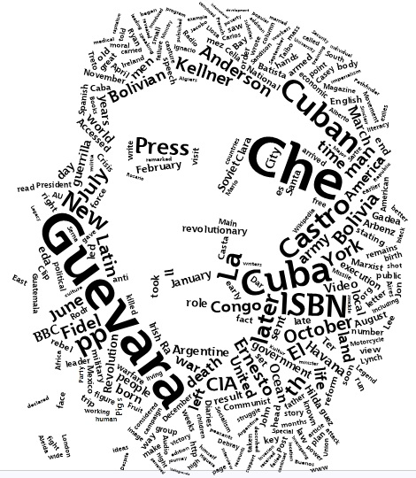

<div align="center">

</div>

> <p dir="RTL"> 
با استفاده از بسته gutenberg داده های لازم را به دست آورید و به سوالات زیر پاسخ دهید.
</p>

***
<p dir="RTL">
بارگزاری داده ها و کتابخانه ها:
</p>

```{r, message=FALSE, warning=FALSE, comment=NA}
library(gutenbergr)
library(dplyr)
library(stringr)
library(tidytext)
```

***

<p dir="RTL">
۱. چارلز دیکنز نویسنده معروف انگلیسی بالغ بر چهارده رمان (چهارده و نیم) نوشته است. متن تمامی کتاب های او را دانلود کنید و سپس بیست لغت برتر استفاده شده را به صورت یک نمودار ستونی نمایش دهید. (طبیعتا باید ابتدا متن را پاکسازی کرده و stopping words را حذف نمایید تا به کلماتی که بار معنایی مشخصی منتقل می کنند برسید.)
</p>

<p dir="RTL">
ابتدا تمامی کتاب های چارلز دیکنز را با کمک
gutenberg 
بدست می آوریم. البته تعدادی کتاب تکراری وجود داشت که آنها را حذف کردیم. سپس تک تک کتاب را دانلود کرده و آن ها را در 
book_texts 
ذخیره می کنیم. (در سایر بخش های تمرین از این داده برای تحلیل متن بهره می بریم.)
</p>

```{r, message=FALSE, warning=FALSE, comment=NA}
library(highcharter)

dickens_list <- gutenberg_works(author == "Dickens, Charles")
dickens_list <- dickens_list[-c(51, 59, 65, 67, 68, 69, 70, 71, 72), ]
dickens_list <- dickens_list %>% select(gutenberg_id, title)
```

```{r, message=FALSE, warning=FALSE, comment=NA, eval=FALSE}
books_texts = list()

# downloading all books
for( i in 1:nrow(dickens_list)){
  book = gutenberg_download(dickens_list[i, 1, 1])
  books_texts[[i]] = book
}
saveRDS(books_texts, file="data/booktext.rds")
```

<p dir="RTL">
برای بدست آوردن کلماتی که بیشترین تکرار را داشته اند، ابتدا تمامی متن را به 
lowercase 
تبدیل می کنیم. سپس نشانه گذاری را حذف می کنیم و متن را به کلمات آن تقسیم می کنیم. سپس فرآیند فوق را به ازای تمامی رمان ها انجام داده و همه را در یک دیتا فریم قرار می دهیم. در نهایت از این دیتا 
stopwords،
اعداد و تک حرف را حذف می کنیم. در نهایت تکرار کلمات را بدست می آوریم.
</p>

```{r, message=FALSE, warning=FALSE, comment=NA}
books_texts = readRDS(file="data/booktext.rds")
# using books
all_books = list()
for( i in 1:nrow(dickens_list)){
  book = books_texts[[i]]
  wbook = book %>% mutate(text = str_to_lower(text)) %>% 
    select(text) %>% 
    str_replace_all("\"","") %>% 
    str_replace_all("[[:punct:]]","") %>% str_split(pattern = "\\s") %>% 
    unlist() %>% as.data.frame(stringsAsFactors = F)
    if(i == 1){
      all_books = wbook
    } else {
      all_books = bind_rows(all_books, wbook)
    }
}  
  

all_books <- all_books %>% table() %>% 
  as.data.frame(stringsAsFactors = F)
  
colnames(all_books) = c("word","count")

all_books <- all_books %>%
    filter(!word %in% stop_words$word) %>% 
    filter(str_length(word)>1) %>% 
    filter(!str_detect(word,"\\d")) %>%
    arrange(desc(count))

top_words <- all_books %>% slice(1:20)

top_words %>% 
  hchart(type = "column",hcaes(x = word, y = count, color = count)) %>% 
  hc_title(text = "Most repeated words", style = list(fontWeight = "bold")) %>% 
  hc_add_theme(hc_theme_sandsignika())
```


***

<p dir="RTL">
۲. ابر لغات ۲۰۰ کلمه پرتکرار در رمان های چارلز دیکنز را رسم نمایید. این کار را با بسته wordcloud2 انجام دهید. برای دانلود می توانید به لینک زیر مراجعه کنید.
</p>

https://github.com/Lchiffon/wordcloud2

<p dir="RTL">
 با استفاده از عکسی که در ابتدا متن آمده ابر لغاتی مانند شکل زیر رسم کنید. (راهنمایی: از ورودی figpath در دستور wordcloud2 استفاده نمایید.مثالی در زیر آورده شده است.)
</p>

<div align="center">

</div>

<p dir="RTL">
ابتدا بسته ی 
wordcloud2 
را نصب می کنیم، سپس سعی می کنیم که ابرلغات را به صورت صورت یک انسان رسم کنیم.
</p>

```{r, message=FALSE, warning=FALSE, comment=NA}
library(wordcloud2)

word_fig <- all_books %>% slice(1:200) %>% select(word, freq = count)

wordcloud2(word_fig , figPath = "images/face.png" ,size = 0.65, color = "black")
```

***

<p dir="RTL">
۳. اسم پنج شخصیت اصلی در هر رمان دیکنز را استخراج کنید و با نموداری تعداد دفعات تکرار شده بر حسب رمان را رسم نمایید. (مانند مثال کلاس در رسم اسامی شخصیت ها در سری هر پاتر)
</p>

<p dir="RTL">
برای بدست آوردن شخصیت ها، ابتدا نشانه گذاری ها را از متن کتاب حذف کرده و سپس آن را تبدیل به کلمات می کنیم. سپس 
stopwords، 
اعداد، تک حرف، کلماتی که با حرف کوچک شروع می شوند و کلماتی که هم با حروف بزرگ و هم حروف کوچک قرار دارند را حدف می کنیم. سپس فرآیند فوق را به ازای تمامی رمان ها انجام می دهیم. حال از آنجایی که تعداد آثار چارلز دیکنز نزدیک به ۶۰ کتاب است، زیر مجموعه ای از کتاب ها را در نظر میگیریم. سپس ۵ شخصیت پرتکرار هر کتاب را که بیشترین درصد حضور در متن را دارند را به عنوان شخصیت اصلی قرار می دهیم.
</p>

```{r, message=FALSE, warning=FALSE, comment=NA}
library(highcharter)

character_list = list()
for( i in 1:nrow(dickens_list)){
  book = books_texts[[i]]
  wbook = book %>% 
    str_replace_all("\"","") %>% 
    str_replace_all("[[:punct:]]","") %>% 
    str_split(pattern = "\\s") %>% 
    unlist() %>% 
    table() %>% 
    as.data.frame(stringsAsFactors = F)
  
  colnames(wbook) = c("word","count")
  wbook = wbook %>%
    filter(!str_to_lower(word) %in% stop_words$word) %>% 
    filter(str_length(word)>1) %>% 
    filter(!str_detect(word,"\\d")) %>%
    arrange(desc(count)) %>% 
    mutate(proper = !word %in% str_to_lower(word)) %>% 
    mutate(Book = dickens_list[i,2,1]) %>% 
    filter(proper == TRUE)
  character_list[[i]] = wbook
}

characters = bind_rows(character_list)

characters <- characters %>% group_by(Book) %>% 
  mutate(mean_count = mean(count)) %>% 
  ungroup() %>% 
  filter(mean_count >= 6) %>% 
  select(name = word, count, Book)
    
top_characters <- characters %>% 
  group_by(Book) %>% 
  mutate(percent = round(100*count/sum(count))) %>% 
  arrange(desc(percent)) %>% 
  mutate(rank = row_number() %>% as.integer()) %>% 
  filter(rank < 6)

top_characters %>% 
  hchart("column", hcaes(x = name, y = percent, group = Book)) %>% 
  hc_add_theme(hc_theme_google())
```

***

<p dir="RTL">
۴.  در بسته tidytext داده ایی به نام sentiments وجود دارد که فضای احساسی لغات را مشخص می نماید. با استفاده از این داده نمودار ۲۰ لغت برتر negative و ۲۰ لغت برتر positive را در کنار هم رسم نمایید. با استفاده از این نمودار فضای حاکم بر داستان چگونه ارزیابی می کنید؟ (به طور مثال برای کتاب داستان دو شهر فضای احساسی داستان به ترتیب تکرر در نمودار زیر قابل مشاهده است.)
</p>

<div align="center">

</div>

***

<p dir="RTL">
۵. متن داستان بینوایان را به ۲۰۰ قسمت مساوی تقسیم کنید. برای هر قسمت تعداد لغات positive و negative را حساب کنید و سپس این دو سری زمانی را در کنار هم برای مشاهده فضای احساسی داستان رسم نمایید.
</p>

***

<p dir="RTL">
۶. ابتدا ترکیبات دوتایی کلماتی که پشت سر هم می آیند را استخراج کنید و سپس نمودار ۳۰ جفت لغت پرتکرار را رسم نمایید.
</p>

***

<p dir="RTL">
۷. جفت کلماتی که با she و یا he آغاز می شوند را استخراج کنید. بیست فعل پرتکراری که زنان و مردان در داستان های دیکنز انجام می دهند را استخراج کنید و نمودار آن را رسم نمایید.
</p>

***

<p dir="RTL">
۸. برای کتاب های دیکنز ابتدا هر فصل را جدا کنید. سپی برای هر فصل 
1-gram, 2-gram
را استخراج کنید. آیا توزیع  N-gram
در کارهای دیکنز یکسان است؟ با رسم نمودار هم این موضوع را بررسی کنید.
</p>

***

<p dir="RTL"> 
۹. برای آثار ارنست همینگوی نیز تمرین ۸ را تکرار کنید. آیا بین آثار توزیع n-grams در بین آثار این دو نویسنده یکسان است؟
</p>

***

<p dir="RTL"> 
۱۰. بر اساس دادهایی که در تمرین ۸ و ۹ از آثار دو نویسنده به دست آوردید و با استفاده از  N-gram ها یک مدل لاجستیک برای تشخیص صاحب اثر بسازید. خطای مدل چقدر است؟ برای یادگیری مدل از کتاب کتاب الیور تویست اثر دیکنز و کتاب پیرمرد و دریا استفاده نکنید. پس از ساختن مدل برای تست کردن فصل های این کتابها را به عنوان داده ورودی به مدل بدهید. خطای تشخیص چقدر است؟
</p>

