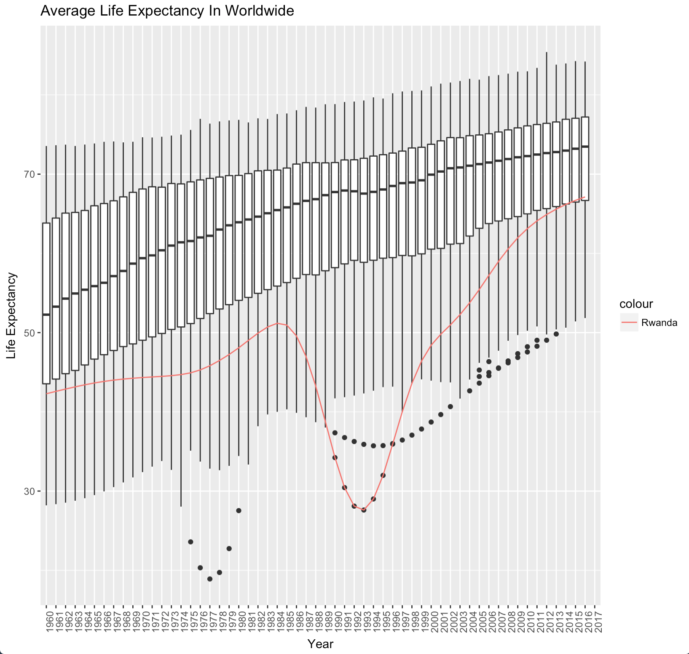

<div align="center">

</div>

> <p dir="RTL"> 
با توجه به داده بانک جهانی به سوالات زیر پاسخ دهید. برای استفاده از داده از سه فایل زیر استفاده نمایید.
داده نام کشورها: WDICountry
داده نام سری های زمانی: WDISeries
داده کل: WDIData
در صورتی که داده را در اختیار ندارید می توانید از بسته WDI استفاده نموده و داده های مورد نظر را استخراج نمایید.
</p>

***
<p dir="RTL">
بارگذاری داده ها و کتابخانه ها:
</p>

```{r, message=FALSE, warning=FALSE, comment=NA}
library(readr)
library(dplyr)
library(ggplot2)
library(highcharter)
library(stringr)

wdi_data = read_csv('data/WDIData.csv')
```

```{r, message=FALSE, warning=FALSE, comment=NA}

```

<p dir="RTL">

</p>

***

<p dir="RTL">
۱. ده کشور فقیر دنیا را بیابید. نمودار درآمد روزانه آنها را رسم کنید. چند درصد از اعضای این کشورها زیر خط فقر هستند؟ متوسط عمر در این کشورها چقدر است؟
</p>

<p dir="RTL">
برای حل این سوال  ابتدا ستون های مورد نظر را برای سال ۲۰۱۶ پیدا می کنیم. فقط از آنجایی که خط فقر 
NA 
زیادی داشت از سال ۲۰۱۴ آن استفاده می کنیم. سپس بر اساس فقر مرتب کرده و ده کشور فقیر را انتخاب می کنیم. سپس خط فقر و امید به زندگی را رسم می کنیم. در نهایت نمودار را رسم می کنیم.
</p>

```{r, message=FALSE, warning=FALSE, comment=NA}
poverty <- wdi_data %>%  filter(`Indicator Code`== 'NY.GDP.PCAP.PP.CD') %>% 
  select(country = `Country Name`, poverty = `2016`)

income <- wdi_data %>% filter(`Indicator Code`== 'NY.ADJ.NNTY.CD') %>% 
  select(country = `Country Name`, income = `2016`)

poverty_line <- wdi_data %>% filter(`Indicator Code`== 'SI.POV.NAHC') %>% 
  select(country = `Country Name`, poverty_line = `2014`)

life_expectancy <- wdi_data %>% filter(`Indicator Code`== 'SP.DYN.LE00.IN') %>% 
  select(country = `Country Name`, life_expectancy = `2016`)

population <- wdi_data %>% filter(`Indicator Code`== 'SP.POP.TOTL') %>% 
  select(country = `Country Name`, population = `2016`)

poverty <- poverty %>%  inner_join(income, by = c("country")) %>% 
  inner_join(population, by = c("country")) %>% 
  inner_join(poverty_line, by = c("country")) %>% 
  inner_join(life_expectancy, by = c("country")) %>% 
  arrange(poverty) %>% 
  mutate(daily_income = income/(365*population)) %>% 
  slice(1:10)
  
knitr::kable(poverty)

poverty %>% arrange(daily_income) %>% 
  hchart(type = "column", hcaes(x = country, y = daily_income)) %>% 
  hc_yAxis(title = list(text = "Daily Income")) %>% 
  hc_xAxis(title = list(text = "Country")) %>% 
  hc_title(text = "Daily Income in Poor Countries", style = list(fontWeight = "bold")) %>% 
  hc_add_theme(hc_theme_ffx())

```


***

<p dir="RTL">
۲. تراژدی روآندا: بر اساس داده های امید به زندگی ابتدا نمودار سالانه نمودار جعبه ایی امید به زندگی کشورها را رسم نمایید(در یک نمودار!). سپس سری زمانی امید به زندگی روآندا را به آن اضافه کنید. چه می بینید؟ چند میلیون نفر کشته شدند؟
</p>

<p dir="RTL">
برای حل این سوال، امید به زندگی را در تمامی سال ها بدست می آوریم. سپس نمودار را از ستونی به ردیفی به کمک
melt 
تبدیل می کنیم. در نهایت نمودار جعبه را می کشیم.
</p>

```{r, message=FALSE, warning=FALSE, comment=NA}
library(reshape2)

life_expectancy <- wdi_data %>% filter(`Indicator Code`== 'SP.DYN.LE00.IN') %>% 
  select(country = `Country Name`, matches('\\d{4}')) %>% 
  melt(id.vars=c('country'))

rwd_life_expectancy <- life_expectancy %>% filter(country == 'Rwanda')
```


```{r, message=FALSE, warning=FALSE, comment=NA, eval=FALSE}
p = ggplot(data = life_expectancy, mapping = aes(x = variable, y = value)) + geom_boxplot() +
  geom_line(data = rwd_life_expectancy, mapping = aes(x = variable, y = value, group = 1, color = 'Rwanda')) + 
  xlab("Year") + ylab("Life Expectancy") + ggtitle("Average Life Expectancy Worldwide") + 
  theme(axis.text.x = element_text(angle = 90, hjust = 1)) 
p
```

<div align="center">

</div>

<p dir="RTL">
مشاهده می کنیم که در این سال ها امید به زندگی در روآندا با اختلاف از سایر کشورها کمتر است که علت آن نسل کشی توسط دولت بوده است. همچنین در زیر می بینیم که یک میلیون نفر در این دوران کشته شده اند.
</p>

```{r, message=FALSE, warning=FALSE, comment=NA}
rwd_death <- wdi_data %>% filter(`Indicator Code`== 'SP.DYN.CDRT.IN') %>% 
  select(country = `Country Name`, matches('\\d{4}')) %>% filter(country == 'Rwanda') %>% 
  melt(id.vars=c('country')) %>% filter(!is.na(value)) %>% 
  summarise(tot_death = 1000*sum(value))

cat("Total Death in Rwanda is", rwd_death[1,], "people.")
```

***

<p dir="RTL">
۳. نمودار امید به زندگی و هزینه های بهداشتی را رسم کنید. چه نتیجه ایی می گیرید؟
</p>

<p dir="RTL">

</p>

```{r, message=FALSE, warning=FALSE, comment=NA}

```

***

<p dir="RTL">
۴. آیا قدرت خرید خانواده های ایرانی در ۵۰ سال اخیر افزایش یافته است؟ برای این کار از داده های اقتصادی خانوار استفاده کنید.
</p>

<p dir="RTL">

</p>

```{r, message=FALSE, warning=FALSE, comment=NA}

```

***

<p dir="RTL">
۵. رشد اقتصادی ایران را با کشورهای دیگر در طول ۲۰ سال گذشته بر حسب بیست شاخص های اقتصادی مهم مانند تولید ناخالص ملی، تورم و … ارزیابی کنید! (برای هر شاخص از تصویرسازی استفاده کنید.)
</p>

<p dir="RTL">

</p>

```{r, message=FALSE, warning=FALSE, comment=NA}

```

***

<p dir="RTL">
۶. در قسمت قبل با استفاده از روش خوشه بندی k-means داده ها را به سه دسته تقسیم کنید. ایران در کدام دسته می گنجد؟ (پیش از خوشه بندی طبیعتا داده را باید پاکسازی و استاندارد سازی نمایید.)
</p>

<p dir="RTL">

</p>

```{r, message=FALSE, warning=FALSE, comment=NA}

```

***

<p dir="RTL">
۷. به وسیله تحلیل مولفه اصلی بعد داده رو به دو کاهش دهید سپس خوشه های به دست آمده در قسمت قبل را بر روی آن نمایش دهید. آیا عملکرد روش خوشه بندی شما مطلوب بوده است؟
</p>

<p dir="RTL">

</p>

```{r, message=FALSE, warning=FALSE, comment=NA}

```

***

<p dir="RTL">
۸. با استفاده از داده روشی برای پیش بینی رشد اقتصادی ایران در سال آینده ارائه دهید.
</p>

<p dir="RTL">

</p>

```{r, message=FALSE, warning=FALSE, comment=NA}

```

***

<p dir="RTL"> 
۹. سوالهای ۵ تا ۷ را ابتدا برای ۲۰ شاخص سلامت سپس بر حسب ۲۰ شاخص آموزشی تکرار کنید.
</p>

<p dir="RTL">

</p>

```{r, message=FALSE, warning=FALSE, comment=NA}

```

***

<p dir="RTL"> 
۱۰. کشورهای دنیا را بر حسب ۶۰ شاخص اقتصادی، سلامت و آموزش با روش سلسله مراتبی خوشه بندی کرده و دندروگرام آن را رسم نمایید. اگر داده ها بر سه دسته تقسیم شوند ایران در کدام دسته می گنجد؟
</p>

<p dir="RTL">

</p>

```{r, message=FALSE, warning=FALSE, comment=NA}

```

***

<p dir="RTL"> 
۱۱. سه یافته جالب از داده ها استخراج کنید.
</p>

<p dir="RTL">

</p>

```{r, message=FALSE, warning=FALSE, comment=NA}

```
