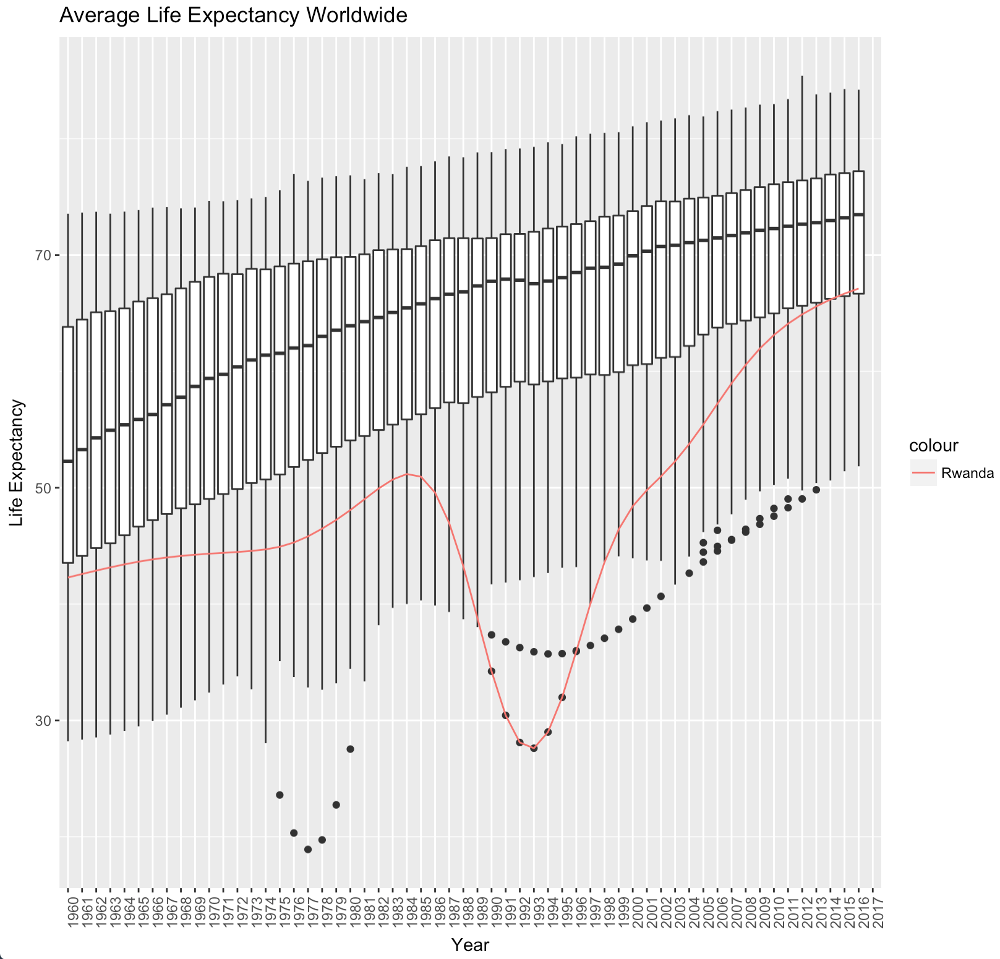
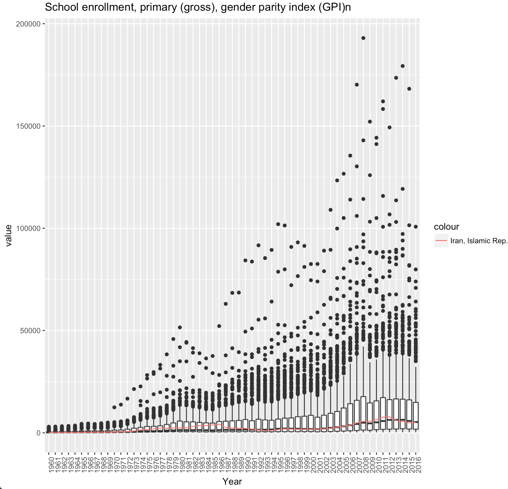

<div align="center">

</div>

> <p dir="RTL"> 
با توجه به داده بانک جهانی به سوالات زیر پاسخ دهید. برای استفاده از داده از سه فایل زیر استفاده نمایید.
داده نام کشورها: WDICountry
داده نام سری های زمانی: WDISeries
داده کل: WDIData
در صورتی که داده را در اختیار ندارید می توانید از بسته WDI استفاده نموده و داده های مورد نظر را استخراج نمایید.
</p>

***
<p dir="RTL">
بارگذاری داده ها و کتابخانه ها:
</p>

```{r, message=FALSE, warning=FALSE, comment=NA}
library(readr)
library(dplyr)
library(ggplot2)
library(highcharter)
library(stringr)

wdi_data = read_csv('data/WDIData.csv')
```

***

<p dir="RTL">
۱. ده کشور فقیر دنیا را بیابید. نمودار درآمد روزانه آنها را رسم کنید. چند درصد از اعضای این کشورها زیر خط فقر هستند؟ متوسط عمر در این کشورها چقدر است؟
</p>

<p dir="RTL">
برای حل این سوال  ابتدا ستون های مورد نظر را برای سال ۲۰۱۶ پیدا می کنیم. فقط از آنجایی که خط فقر 
NA 
زیادی داشت از سال ۲۰۱۴ آن استفاده می کنیم. سپس بر اساس فقر مرتب کرده و ده کشور فقیر را انتخاب می کنیم. سپس خط فقر و امید به زندگی را رسم می کنیم. در نهایت نمودار را رسم می کنیم.
</p>

```{r, message=FALSE, warning=FALSE, comment=NA}
poverty <- wdi_data %>%  filter(`Indicator Code`== 'NY.GDP.PCAP.PP.CD') %>% 
  select(country = `Country Name`, poverty = `2016`)

income <- wdi_data %>% filter(`Indicator Code`== 'NY.ADJ.NNTY.CD') %>% 
  select(country = `Country Name`, income = `2016`)

poverty_line <- wdi_data %>% filter(`Indicator Code`== 'SI.POV.NAHC') %>% 
  select(country = `Country Name`, poverty_line = `2014`)

life_expectancy <- wdi_data %>% filter(`Indicator Code`== 'SP.DYN.LE00.IN') %>% 
  select(country = `Country Name`, life_expectancy = `2016`)

population <- wdi_data %>% filter(`Indicator Code`== 'SP.POP.TOTL') %>% 
  select(country = `Country Name`, population = `2016`)

poverty <- poverty %>%  inner_join(income, by = c("country")) %>% 
  inner_join(population, by = c("country")) %>% 
  inner_join(poverty_line, by = c("country")) %>% 
  inner_join(life_expectancy, by = c("country")) %>% 
  arrange(poverty) %>% 
  mutate(daily_income = income/(365*population)) %>% 
  slice(1:10)
  
knitr::kable(poverty)

poverty %>% arrange(daily_income) %>% 
  hchart(type = "column", hcaes(x = country, y = daily_income)) %>% 
  hc_yAxis(title = list(text = "Daily Income")) %>% 
  hc_xAxis(title = list(text = "Country")) %>% 
  hc_title(text = "Daily Income in Poor Countries", style = list(fontWeight = "bold")) %>% 
  hc_add_theme(hc_theme_ffx())

```


***

<p dir="RTL">
۲. تراژدی روآندا: بر اساس داده های امید به زندگی ابتدا نمودار سالانه نمودار جعبه ایی امید به زندگی کشورها را رسم نمایید(در یک نمودار!). سپس سری زمانی امید به زندگی روآندا را به آن اضافه کنید. چه می بینید؟ چند میلیون نفر کشته شدند؟
</p>

<p dir="RTL">
برای حل این سوال، امید به زندگی را در تمامی سال ها بدست می آوریم. سپس نمودار را از ستونی به ردیفی به کمک
melt 
تبدیل می کنیم. در نهایت نمودار جعبه را می کشیم.
</p>

```{r, message=FALSE, warning=FALSE, comment=NA}
library(reshape2)

life_expectancy <- wdi_data %>% filter(`Indicator Code`== 'SP.DYN.LE00.IN') %>% 
  select(country = `Country Name`, matches('\\d{4}')) %>% 
  melt(id.vars=c('country'))

rwd_life_expectancy <- life_expectancy %>% filter(country == 'Rwanda')
```


```{r, message=FALSE, warning=FALSE, comment=NA, eval=FALSE}
p = ggplot(data = life_expectancy, mapping = aes(x = variable, y = value)) + geom_boxplot() +
  geom_line(data = rwd_life_expectancy, mapping = aes(x = variable, y = value, group = 1, color = 'Rwanda')) + 
  xlab("Year") + ylab("Life Expectancy") + ggtitle("Average Life Expectancy Worldwide") + 
  theme(axis.text.x = element_text(angle = 90, hjust = 1)) 
p
```

<div align="center">

</div>

<p dir="RTL">
مشاهده می کنیم که در این سال ها امید به زندگی در روآندا با اختلاف از سایر کشورها کمتر است که علت آن نسل کشی توسط دولت بوده است. همچنین در زیر می بینیم که یک میلیون نفر در این دوران کشته شده اند.
</p>

```{r, message=FALSE, warning=FALSE, comment=NA}
rwd_death <- wdi_data %>% filter(`Indicator Code`== 'SP.DYN.CDRT.IN') %>% 
  select(country = `Country Name`, matches('\\d{4}')) %>% filter(country == 'Rwanda') %>% 
  melt(id.vars=c('country')) %>% filter(!is.na(value)) %>% 
  summarise(tot_death = 1000*sum(value))

cat("Total Death in Rwanda is", rwd_death[1,], "people.")
```

***

<p dir="RTL">
۳. نمودار امید به زندگی و هزینه های بهداشتی را رسم کنید. چه نتیجه ایی می گیرید؟
</p>

<p dir="RTL">
برای حل این سوال همانند بالا داده را در باره ی هزینه های بهداشتی نیز بدست می آوریم، منتهی برای آنکه رنج آن با امید به زندگی قابل مقایسه باشد داده ها را به ۱۰۰ تقسیم می کنیم و دو نمودار را کنار یکدیگر رسم می کنیم.
</p>

```{r, message=FALSE, warning=FALSE, comment=NA}
health <- wdi_data %>% filter(`Indicator Code`== 'SH.XPD.CHEX.PC.CD') %>% 
  select(country = `Country Name`, matches('\\d{4}')) %>% 
  melt(id.vars=c('country')) %>% 
  mutate(value = value/100, type = 'health') %>% 
  filter(!is.na(value))

life_expectancy <- life_expectancy %>% filter(!is.na(value)) %>% mutate(type = 'life expectancy')

health_expect <- health %>% rbind(life_expectancy)

p = ggplot(data = health_expect, mapping = aes(x = variable, y = value, fill = type, color = type)) + geom_boxplot() +
  xlab("Year") + ylab("Life Expectancy or Health Cost") + ggtitle("Average Life Expectancy and Health Cost Worldwide") + 
  theme(axis.text.x = element_text(angle = 90, hjust = 1)) 
```

<div align="center">

</div>

<p dir="RTL">
همانطور که انتظار می رود، هر چه امید به زندگی به طور میانگین بالا می رود، میزان هزینه های بهداشتی و اهمیت افراد به بهداشت خود نیز افزایش پیدا می کند.
</p>

***

<p dir="RTL">
۴. آیا قدرت خرید خانواده های ایرانی در ۵۰ سال اخیر افزایش یافته است؟ برای این کار از داده های اقتصادی خانوار استفاده کنید.
</p>

<p dir="RTL">
برای این سوال همانند سوال بالا ردیف مناسب با ستون های مناسب را به ازای تمامی سال ها برای ایران بدست می آوریم و نمودار را می کشیم.
</p>

```{r, message=FALSE, warning=FALSE, comment=NA}
iran_buy_cap <- wdi_data %>% filter(`Indicator Code`== 'NY.GDP.PCAP.PP.CD') %>% 
  select(country = `Country Name`, matches('\\d{4}')) %>% 
  filter(country == 'Iran, Islamic Rep.') %>% 
  melt(id.vars=c('country')) %>% 
  filter(!is.na(value))

iran_buy_cap %>% arrange(variable) %>% 
  hchart(type = "line", hcaes(x = variable, y = value)) %>% 
  hc_yAxis(title = list(text = "Purchasing Capability")) %>% 
  hc_xAxis(title = list(text = "Year")) %>% 
  hc_title(text = "Purchasing Capability in Iran", style = list(fontWeight = "bold")) %>% 
  hc_add_theme(hc_theme_economist())
```

<p dir="RTL">
همانطور که می بینیم قدرت خرید در ایران زیاد شده است، اما در پایان سال ۲۰۱۲ که با پایان دولت قبلی همزمان است، میزان قدرت خرید به علت اختلاس ها و عدم کنترل وضعیت اقتصادی افت کرده است.
</p>

***

<p dir="RTL">
۵. رشد اقتصادی ایران را با کشورهای دیگر در طول ۲۰ سال گذشته بر حسب بیست شاخص های اقتصادی مهم مانند تولید ناخالص ملی، تورم و … ارزیابی کنید! (برای هر شاخص از تصویرسازی استفاده کنید.)
</p>

<p dir="RTL">
برای حل این سوال ۲۰ معیاری که مقادیر
NA 
کمتری دارد را می یابیم و در حل مرحله داده ی جهانی را با ایران مقایسه می کنیم. نام شاخص در عنوان خطوط نمودار آمده است. البته مشاهده می کنیم که دو نمودار تقریبا داده ای ندارند.
</p>

```{r, message=FALSE, warning=FALSE, comment=NA}
world_ec <- wdi_data %>% filter(`Indicator Code`== 'NE.EXP.GNFS.CD') %>% 
  select(country = `Country Name`, index = `Indicator Name`, matches('^199[6-9]|^20[0-1][0-9]')) %>% 
  rbind(wdi_data %>% filter(`Indicator Code`== 'NY.GDP.PCAP.CD') %>% 
          select(country = `Country Name`, index = `Indicator Name`, matches('^199[6-9]|^20[0-1][0-9]'))) %>% 
  rbind(wdi_data %>% filter(`Indicator Code`== 'NY.GNP.MKTP.CD') %>% 
          select(country = `Country Name`, index = `Indicator Name`, matches('^199[6-9]|^20[0-1][0-9]'))) %>% 
  rbind(wdi_data %>% filter(`Indicator Code`== 'NE.GDI.FTOT.KD.ZG') %>% 
          select(country = `Country Name`, index = `Indicator Name`, matches('^199[6-9]|^20[0-1][0-9]'))) %>% 
  rbind(wdi_data %>% filter(`Indicator Code`== 'BX.KLT.DINV.CD.WD') %>% 
          select(country = `Country Name`, index = `Indicator Name`, matches('^199[6-9]|^20[0-1][0-9]'))) %>% 
  rbind(wdi_data %>% filter(`Indicator Code`== 'BM.GSR.GNFS.CD') %>% 
          select(country = `Country Name`, index = `Indicator Name`, matches('^199[6-9]|^20[0-1][0-9]'))) %>% 
  rbind(wdi_data %>% filter(`Indicator Code`== 'BN.GSR.FCTY.CD') %>% 
          select(country = `Country Name`, index = `Indicator Name`, matches('^199[6-9]|^20[0-1][0-9]'))) %>% 
  rbind(wdi_data %>% filter(`Indicator Code`== 'FP.CPI.TOTL.ZG') %>% 
          select(country = `Country Name`, index = `Indicator Name`, matches('^199[6-9]|^20[0-1][0-9]'))) %>% 
  rbind(wdi_data %>% filter(`Indicator Code`== 'FM.LBL.BMNY.GD.ZS') %>% 
          select(country = `Country Name`, index = `Indicator Name`, matches('^199[6-9]|^20[0-1][0-9]'))) %>% 
  rbind(wdi_data %>% filter(`Indicator Code`== 'NV.AGR.TOTL.ZS') %>% 
          select(country = `Country Name`, index = `Indicator Name`, matches('^199[6-9]|^20[0-1][0-9]'))) %>% 
  rbind(wdi_data %>% filter(`Indicator Code`== 'NE.CON.TETC.ZS') %>% 
          select(country = `Country Name`, index = `Indicator Name`, matches('^199[6-9]|^20[0-1][0-9]'))) %>% 
  rbind(wdi_data %>% filter(`Indicator Code`== 'NE.CON.GOVT.ZS') %>% 
          select(country = `Country Name`, index = `Indicator Name`, matches('^199[6-9]|^20[0-1][0-9]'))) %>% 
  rbind(wdi_data %>% filter(`Indicator Code`== 'NV.IND.MANF.ZS') %>% 
          select(country = `Country Name`, index = `Indicator Name`, matches('^199[6-9]|^20[0-1][0-9]'))) %>% 
  rbind(wdi_data %>% filter(`Indicator Code`== 'MS.MIL.XPND.GD.ZS') %>% 
          select(country = `Country Name`, index = `Indicator Name`, matches('^199[6-9]|^20[0-1][0-9]'))) %>% 
  rbind(wdi_data %>% filter(`Indicator Code`== 'TG.VAL.TOTL.GD.ZS') %>% 
          select(country = `Country Name`, index = `Indicator Name`, matches('^199[6-9]|^20[0-1][0-9]'))) %>% 
  rbind(wdi_data %>% filter(`Indicator Code`== 'NY.GDP.TOTL.RT.ZS') %>% 
          select(country = `Country Name`, index = `Indicator Name`, matches('^199[6-9]|^20[0-1][0-9]'))) %>% 
  rbind(wdi_data %>% filter(`Indicator Code`== 'NE.TRD.GNFS.ZS') %>% 
          select(country = `Country Name`, index = `Indicator Name`, matches('^199[6-9]|^20[0-1][0-9]'))) %>% 
  rbind(wdi_data %>% filter(`Indicator Code`== 'FS.AST.DOMS.GD.ZS') %>% 
          select(country = `Country Name`, index = `Indicator Name`, matches('^199[6-9]|^20[0-1][0-9]'))) %>% 
  rbind(wdi_data %>% filter(`Indicator Code`== 'NY.GNP.MKTP.PP.CD') %>% 
          select(country = `Country Name`, index = `Indicator Name`, matches('^199[6-9]|^20[0-1][0-9]'))) %>% 
  rbind(wdi_data %>% filter(`Indicator Code`== 'SH.UHC.NOP1.TO') %>% 
          select(country = `Country Name`, index = `Indicator Name`, matches('^199[6-9]|^20[0-1][0-9]')))

world_ec_m <- world_ec %>% 
  melt(id.vars=c('country', 'index')) %>% 
  filter(!is.na(value)) %>% 
  group_by(index)
  


plots <- world_ec_m %>% 
  do(
    plots = ggplot(.,aes(x = variable, y = value, color = index)) + geom_boxplot() +
      xlab("Year") + ggtitle("Worldwide Economic vs. Iran") +
      theme(axis.text.x = element_text(angle = 90, hjust = 1)) +
      geom_line(data = subset(.,country == 'Iran, Islamic Rep.'),aes(x = variable, y = value, group = 1, color = 'Iran, Islamic Rep.'))
  )
plots$plots
  
```

<p dir="RTL">
همانطور که در نمودارها می بینیم، ایران تقریبا بر روی میانگین کشورها قرار دارد، اما مقادیری همچون هزینه ی مصرف نهایی از کشورهای دیگر بسیار کمتر است و سرمایه گذاری در خارج آن صفر است. هم چنین میزان تجارت از میانگین کمتر است و میزان اجاره ی منابع طبیعی بسیار بیشتر از سایر کشورها است. در کل ایران اقتصادی متوسط رو به پایین دارد.
</p>


***

<p dir="RTL">
۶. در قسمت قبل با استفاده از روش خوشه بندی k-means داده ها را به سه دسته تقسیم کنید. ایران در کدام دسته می گنجد؟ (پیش از خوشه بندی طبیعتا داده را باید پاکسازی و استاندارد سازی نمایید.)
</p>

<p dir="RTL">
برای پاکسازی داده ها مقادیر ستون های 
NA 
را برابر با صفر قرار می دهیم، سپس برای هر کشور، میانگین مقادیر ستون ها را محاسبه می کنیم. در نهایت به کمک 
kmeans
داده های سال های مختلف برای کشورهای مختلف را به سه دسته تقسیم می کنیم.
</p>

```{r, message=FALSE, warning=FALSE, comment=NA}
# cleaning data
world_ec_cluster <- world_ec
world_ec_cluster[is.na(world_ec)] = 0
patt = "Africa|America|Asia|dividend|Euro|income|members|Middle|only|Sub|total|World"

world_ec_cluster <- world_ec_cluster %>% group_by(country) %>% 
  filter(!grepl(patt,country)) %>% 
  summarise_at(c(2:22), mean)

set.seed(1234)
clusters = kmeans(world_ec_cluster[,2:22], 3)

world_ec_cluster$cluster_no = as.integer(clusters$cluster)

iran_cluster = world_ec_cluster %>% 
  filter(country == 'Iran, Islamic Rep.')

cat("Iran cluster:", iran_cluster[1,23,1])

str(clusters)
```

<p dir="RTL">
نتیجه فوق نشان می دهد ایران در دسته ی سوم قرار دارد.
</p>

***

<p dir="RTL">
۷. به وسیله تحلیل مولفه اصلی بعد داده رو به دو کاهش دهید سپس خوشه های به دست آمده در قسمت قبل را بر روی آن نمایش دهید. آیا عملکرد روش خوشه بندی شما مطلوب بوده است؟
</p>

<p dir="RTL">
ابتدا توسط
pca 
بعد داده ها را به دو بعد کاهش می دهیم و سپس با
kmean 
خوشه بندی می کنیم.
</p>

```{r, message=FALSE, warning=FALSE, comment=NA}
pca = prcomp(world_ec_cluster[,2:22], scale. = TRUE)
x = pca$x[,1:2]
world_ec_cluster <- world_ec_cluster %>%  bind_cols(x %>% as.data.frame())

clusters = kmeans(world_ec_cluster[,24:25], 3)
world_ec_cluster$cluster_no = as.integer(clusters$cluster)

iran_cluster_pca = world_ec_cluster %>% 
  filter(country == 'Iran, Islamic Rep.')

cat("Iran cluster:", iran_cluster[1,23,1])

str(clusters)
```

<p dir="RTL">
همانطور که مشاهده می کنیم هر دو دسته ی سوم را نشان می دهند. پس عملکرد خوشه بندی ما مناسب بوده است.
</p>

***

<p dir="RTL">
۸. با استفاده از داده روشی برای پیش بینی رشد اقتصادی ایران در سال آینده ارائه دهید.
</p>

<p dir="RTL">
از مدل 
glm
استفاده می کنیم و سعی میکنیم سال ۲۰۱۶ را از روی سالهای پیشین بدست بیاوریم که نتایج نشان می دهد که به کمک داده های سال ۲۰۰۷ می توان پیشبینی کرد. اما همانطور که می بینیم مدل ما قوی نیست و خطای زیادی دارد.
</p>

```{r, message=FALSE, warning=FALSE, comment=NA}
iran_ec_m <- world_ec %>% filter(country == 'Iran, Islamic Rep.')
iran_ec_m[is.na(iran_ec_m)] = 0

glm_irn = glm(data = iran_ec_m[,3:23], formula = `2016`~.)
summary(glm_irn)

glm_irn = glm(data = iran_ec_m[,3:23], formula = `2016`~`2007` + `2014`)
summary(glm_irn)

glm_irn = glm(data = iran_ec_m[,3:23], formula = `2016`~`2007`)
summary(glm_irn)

lm_irn = lm(data = iran_ec_m[,3:23], formula = `2016`~.)
summary(lm_irn)
```

***

<p dir="RTL"> 
۹. سوالهای ۵ تا ۷ را ابتدا برای ۲۰ شاخص سلامت سپس بر حسب ۲۰ شاخص آموزشی تکرار کنید.
</p>

<p dir="RTL">
**بهداشت**
<br>
همانند بالا شاخص هایی که 
NA 
کمتری دارند را انتخاب می کنیم. در نهایت می بینیم ایران از نظر بهداشت نیز در دسته ی سوم قرار دارد. هم چنین در این بخش مدل خطی ما برای پیشبینی استفاده می کنیم. می بینیم خطای ما حول صفر است.
</p>

```{r, message=FALSE, warning=FALSE, comment=NA}
# health
# 5
world_hc <- wdi_data %>% filter(`Indicator Code`== 'SH.DYN.AIDS.FE.ZS') %>% 
  select(country = `Country Name`, index = `Indicator Name`, matches('^199[6-9]|^20[0-1][0-9]')) %>% 
  rbind(wdi_data %>% filter(`Indicator Code`== 'SH.DYN.AIDS.ZS') %>% 
          select(country = `Country Name`, index = `Indicator Name`, matches('^199[6-9]|^20[0-1][0-9]'))) %>% 
  rbind(wdi_data %>% filter(`Indicator Code`== 'SH.HIV.1524.MA.ZS') %>% 
          select(country = `Country Name`, index = `Indicator Name`, matches('^199[6-9]|^20[0-1][0-9]'))) %>% 
  rbind(wdi_data %>% filter(`Indicator Code`== 'SH.HIV.1524.FE.ZS') %>% 
          select(country = `Country Name`, index = `Indicator Name`, matches('^199[6-9]|^20[0-1][0-9]'))) %>% 
  rbind(wdi_data %>% filter(`Indicator Code`== 'SH.ANM.ALLW.ZS') %>% 
          select(country = `Country Name`, index = `Indicator Name`, matches('^199[6-9]|^20[0-1][0-9]'))) %>% 
  rbind(wdi_data %>% filter(`Indicator Code`== 'SH.PRG.ANEM') %>% 
          select(country = `Country Name`, index = `Indicator Name`, matches('^199[6-9]|^20[0-1][0-9]'))) %>% 
  rbind(wdi_data %>% filter(`Indicator Code`== 'SH.ANM.NPRG.ZS') %>% 
          select(country = `Country Name`, index = `Indicator Name`, matches('^199[6-9]|^20[0-1][0-9]'))) %>% 
  rbind(wdi_data %>% filter(`Indicator Code`== 'SH.ANM.CHLD.ZS') %>% 
          select(country = `Country Name`, index = `Indicator Name`, matches('^199[6-9]|^20[0-1][0-9]'))) %>% 
  rbind(wdi_data %>% filter(`Indicator Code`== 'SH.DTH.MORT') %>% 
          select(country = `Country Name`, index = `Indicator Name`, matches('^199[6-9]|^20[0-1][0-9]'))) %>% 
  rbind(wdi_data %>% filter(`Indicator Code`== 'SH.DTH.IMRT') %>% 
          select(country = `Country Name`, index = `Indicator Name`, matches('^199[6-9]|^20[0-1][0-9]'))) %>% 
  rbind(wdi_data %>% filter(`Indicator Code`== 'SH.VAC.TTNS.ZS') %>% 
          select(country = `Country Name`, index = `Indicator Name`, matches('^199[6-9]|^20[0-1][0-9]'))) %>% 
  rbind(wdi_data %>% filter(`Indicator Code`== 'SH.DYN.MORT') %>% 
          select(country = `Country Name`, index = `Indicator Name`, matches('^199[6-9]|^20[0-1][0-9]'))) %>% 
  rbind(wdi_data %>% filter(`Indicator Code`== 'SH.DYN.NMRT') %>% 
          select(country = `Country Name`, index = `Indicator Name`, matches('^199[6-9]|^20[0-1][0-9]'))) %>% 
  rbind(wdi_data %>% filter(`Indicator Code`== 'SH.STA.MMRT') %>% 
          select(country = `Country Name`, index = `Indicator Name`, matches('^199[6-9]|^20[0-1][0-9]'))) %>% 
  rbind(wdi_data %>% filter(`Indicator Code`== 'SH.MMR.RISK.ZS') %>% 
          select(country = `Country Name`, index = `Indicator Name`, matches('^199[6-9]|^20[0-1][0-9]'))) %>% 
  rbind(wdi_data %>% filter(`Indicator Code`== 'SH.XPD.GHED.PP.CD') %>% 
          select(country = `Country Name`, index = `Indicator Name`, matches('^199[6-9]|^20[0-1][0-9]'))) %>% 
  rbind(wdi_data %>% filter(`Indicator Code`== 'SH.XPD.GHED.PC.CD') %>% 
          select(country = `Country Name`, index = `Indicator Name`, matches('^199[6-9]|^20[0-1][0-9]'))) %>% 
  rbind(wdi_data %>% filter(`Indicator Code`== 'SH.XPD.CHEX.PC.CD') %>% 
          select(country = `Country Name`, index = `Indicator Name`, matches('^199[6-9]|^20[0-1][0-9]'))) %>% 
  rbind(wdi_data %>% filter(`Indicator Code`== 'SH.HIV.INCD') %>% 
          select(country = `Country Name`, index = `Indicator Name`, matches('^199[6-9]|^20[0-1][0-9]'))) %>% 
  rbind(wdi_data %>% filter(`Indicator Code`== 'SH.HIV.0014') %>% 
          select(country = `Country Name`, index = `Indicator Name`, matches('^199[6-9]|^20[0-1][0-9]')))

world_hc_m <- world_hc %>% 
  melt(id.vars=c('country', 'index')) %>% 
  filter(!is.na(value)) %>% 
  group_by(index)

plots <- world_hc_m %>% 
  do(
    plots = ggplot(.,aes(x = variable, y = value, color = index)) + geom_boxplot() +
      xlab("Year") + ggtitle("Worldwide Health vs. Iran") +
      theme(axis.text.x = element_text(angle = 90, hjust = 1)) +
      geom_line(data = subset(.,country == 'Iran, Islamic Rep.'),aes(x = variable, y = value, group = 1, color = 'Iran, Islamic Rep.'))
  )
plots$plots

# 6
# cleaning data
world_hc_cluster <- world_hc
world_hc_cluster[is.na(world_hc)] = 0
patt = "Africa|America|Asia|dividend|Euro|income|members|Middle|only|Sub|total|World"

world_hc_cluster <- world_hc_cluster %>% group_by(country) %>% 
  filter(!grepl(patt,country)) %>% 
  summarise_at(c(2:22), mean)

set.seed(134)
clusters = kmeans(world_hc_cluster[,2:22], 3)

world_hc_cluster$cluster_no = as.integer(clusters$cluster)

iran_cluster = world_hc_cluster %>% 
  filter(country == 'Iran, Islamic Rep.')

cat("Iran cluster:", iran_cluster[1,23,1])

str(clusters)

# 7
pca = prcomp(world_hc_cluster[,2:22], scale. = TRUE)
x = pca$x[,1:2]
world_hc_cluster <- world_hc_cluster %>%  bind_cols(x %>% as.data.frame())

clusters = kmeans(world_hc_cluster[,24:25], 3)
world_hc_cluster$cluster_no = as.integer(clusters$cluster)

iran_cluster_pca = world_hc_cluster %>% 
  filter(country == 'Iran, Islamic Rep.')

cat("Iran cluster:", iran_cluster[1,23,1])

str(clusters)

# 8
iran_hc_m <- world_hc %>% filter(country == 'Iran, Islamic Rep.')
iran_hc_m[is.na(iran_hc_m)] = 0

lm_irn = lm(data = iran_hc_m[,3:23], formula = `2016`~.)
summary(lm_irn)
```

<p dir="RTL">
**آموزش**
<br>
همانند بالا شاخص هایی که 
NA 
کمتری دارند را انتخاب می کنیم. در نهایت می بینیم ایران از نظر آموزش نیز در دسته ی اول قرار دارد. هم چنین در این بخش مدل خطی ما برای پیشبینی استفاده می کنیم. می بینیم خطای ما حول صفر است.
</p>
```{r, message=FALSE, warning=FALSE, comment=NA}
# education
# 5
world_ed <- wdi_data %>% filter(`Indicator Code`== 'SE.ENR.PRIM.FM.ZS') %>% 
  select(country = `Country Name`, index = `Indicator Name`, matches('^199[6-9]|^20[0-1][0-9]')) %>% 
  rbind(wdi_data %>% filter(`Indicator Code`== 'SE.PRM.DURS') %>% 
          select(country = `Country Name`, index = `Indicator Name`, matches('^199[6-9]|^20[0-1][0-9]'))) %>% 
  rbind(wdi_data %>% filter(`Indicator Code`== 'SE.XPD.TERT.ZS') %>% 
          select(country = `Country Name`, index = `Indicator Name`, matches('^199[6-9]|^20[0-1][0-9]'))) %>% 
  rbind(wdi_data %>% filter(`Indicator Code`== 'SE.XPD.PRIM.Z') %>% 
          select(country = `Country Name`, index = `Indicator Name`, matches('^199[6-9]|^20[0-1][0-9]'))) %>% 
  rbind(wdi_data %>% filter(`Indicator Code`== 'SE.XPD.SECO.ZS') %>% 
          select(country = `Country Name`, index = `Indicator Name`, matches('^199[6-9]|^20[0-1][0-9]'))) %>% 
  rbind(wdi_data %>% filter(`Indicator Code`== 'SE.PRM.ENRR') %>% 
          select(country = `Country Name`, index = `Indicator Name`, matches('^199[6-9]|^20[0-1][0-9]'))) %>% 
  rbind(wdi_data %>% filter(`Indicator Code`== 'SE.PRM.TCHR') %>% 
          select(country = `Country Name`, index = `Indicator Name`, matches('^199[6-9]|^20[0-1][0-9]'))) %>% 
  rbind(wdi_data %>% filter(`Indicator Code`== 'SE.PRM.ENRL') %>% 
          select(country = `Country Name`, index = `Indicator Name`, matches('^199[6-9]|^20[0-1][0-9]'))) %>% 
  rbind(wdi_data %>% filter(`Indicator Code`== 'SE.PRE.ENRL.TC.ZS') %>% 
          select(country = `Country Name`, index = `Indicator Name`, matches('^199[6-9]|^20[0-1][0-9]'))) %>% 
  rbind(wdi_data %>% filter(`Indicator Code`== 'SE.PRE.ENRR') %>% 
          select(country = `Country Name`, index = `Indicator Name`, matches('^199[6-9]|^20[0-1][0-9]'))) %>% 
  rbind(wdi_data %>% filter(`Indicator Code`== 'SE.SEC.PROG.ZS') %>% 
          select(country = `Country Name`, index = `Indicator Name`, matches('^199[6-9]|^20[0-1][0-9]'))) %>% 
  rbind(wdi_data %>% filter(`Indicator Code`== 'SE.SEC.ENRL.GC') %>% 
          select(country = `Country Name`, index = `Indicator Name`, matches('^199[6-9]|^20[0-1][0-9]'))) %>% 
  rbind(wdi_data %>% filter(`Indicator Code`== 'SE.PRM.PRSL.ZS') %>% 
          select(country = `Country Name`, index = `Indicator Name`, matches('^199[6-9]|^20[0-1][0-9]'))) %>% 
  rbind(wdi_data %>% filter(`Indicator Code`== 'SE.SEC.AGES') %>% 
          select(country = `Country Name`, index = `Indicator Name`, matches('^199[6-9]|^20[0-1][0-9]'))) %>% 
  rbind(wdi_data %>% filter(`Indicator Code`== 'SE.PRE.ENRL.TC.ZS') %>% 
          select(country = `Country Name`, index = `Indicator Name`, matches('^199[6-9]|^20[0-1][0-9]'))) %>% 
  rbind(wdi_data %>% filter(`Indicator Code`== 'SE.PRM.TENR.FE') %>% 
          select(country = `Country Name`, index = `Indicator Name`, matches('^199[6-9]|^20[0-1][0-9]'))) %>% 
  rbind(wdi_data %>% filter(`Indicator Code`== 'SE.SEC.ENRL') %>% 
          select(country = `Country Name`, index = `Indicator Name`, matches('^199[6-9]|^20[0-1][0-9]'))) %>% 
  rbind(wdi_data %>% filter(`Indicator Code`== 'SE.PRM.NENR') %>% 
          select(country = `Country Name`, index = `Indicator Name`, matches('^199[6-9]|^20[0-1][0-9]'))) %>% 
  rbind(wdi_data %>% filter(`Indicator Code`== 'SE.SEC.DURS') %>% 
          select(country = `Country Name`, index = `Indicator Name`, matches('^199[6-9]|^20[0-1][0-9]'))) %>% 
  rbind(wdi_data %>% filter(`Indicator Code`== 'SE.PRM.AGES') %>% 
          select(country = `Country Name`, index = `Indicator Name`, matches('^199[6-9]|^20[0-1][0-9]')))

world_ed_m <- world_ed %>% 
  melt(id.vars=c('country', 'index')) %>% 
  filter(!is.na(value)) %>% 
  group_by(index)

plots <- world_ed_m %>% 
  do(
    plots = ggplot(.,aes(x = variable, y = value, color = index)) + geom_boxplot() +
      xlab("Year") + ggtitle("Worldwide Education vs. Iran") +
      theme(axis.text.x = element_text(angle = 90, hjust = 1)) +
      geom_line(data = subset(.,country == 'Iran, Islamic Rep.'),aes(x = variable, y = value, group = 1, color = 'Iran, Islamic Rep.'))
  )
plots$plots

# 6
# cleaning data
world_ed_cluster <- world_ed
world_ed_cluster[is.na(world_ed)] = 0
patt = "Africa|America|Asia|dividend|Euro|income|members|Middle|only|Sub|total|World"

world_ed_cluster <- world_ed_cluster %>% group_by(country) %>% 
  filter(!grepl(patt,country)) %>% 
  summarise_at(c(2:22), mean)

set.seed(134)
clusters = kmeans(world_ed_cluster[,2:22], 3)

world_ed_cluster$cluster_no = as.integer(clusters$cluster)

iran_cluster = world_ed_cluster %>% 
  filter(country == 'Iran, Islamic Rep.')

cat("Iran cluster:", iran_cluster[1,23,1])

str(clusters)

# 7
pca = prcomp(world_ed_cluster[,2:22], scale. = TRUE)
x = pca$x[,1:2]
world_ed_cluster <- world_ed_cluster %>%  bind_cols(x %>% as.data.frame())

clusters = kmeans(world_ed_cluster[,24:25], 3)
world_ed_cluster$cluster_no = as.integer(clusters$cluster)

iran_cluster_pca = world_ed_cluster %>% 
  filter(country == 'Iran, Islamic Rep.')

cat("Iran cluster:", iran_cluster[1,23,1])

str(clusters)

# 8
iran_ed_m <- world_ed %>% filter(country == 'Iran, Islamic Rep.')
iran_ed_m[is.na(iran_ed_m)] = 0

lm_irn = lm(data = iran_ed_m[,3:23], formula = `2016`~.)
summary(lm_irn)
```

***

<p dir="RTL"> 
۱۰. کشورهای دنیا را بر حسب ۶۰ شاخص اقتصادی، سلامت و آموزش با روش سلسله مراتبی خوشه بندی کرده و دندروگرام آن را رسم نمایید. اگر داده ها بر سه دسته تقسیم شوند ایران در کدام دسته می گنجد؟
</p>

<p dir="RTL">

</p>

```{r, message=FALSE, warning=FALSE, comment=NA, eval=FALSE}
library(ape)
ec_sixty = bind_cols(world_ec_cluster,world_ed_cluster,world_hc_cluster)

hcut = cutree(hclust(dist(ec_sixty, method = "euclidean"),method = "complete"),k=3)
cat(hcut['Iran, Islamic Rep.'])

plot(as.phylo(hclust(dist(ec_sixty, method = "euclidean"),method = "complete")), cex = 0.3, label.offset = 0)
```

***

<p dir="RTL"> 
۱۱. سه یافته جالب از داده ها استخراج کنید.
</p>

<p dir="RTL">
**بیشترین امید به زندگی در دنیا**
</p>

```{r, message=FALSE, warning=FALSE, comment=NA}
# a
max_life_exp <- life_expectancy %>% group_by(country) %>% 
  summarise(exp = mean(value)) %>% arrange(desc(exp)) %>% slice(1:10)

knitr::kable(max_life_exp)
```
<p dir="RTL">
**تفاوت ایران با دنیا در شرکت در مدرسه**
</p>
```{r, message=FALSE, warning=FALSE, comment=NA}
# b
edm <-wdi_data %>% filter(`Indicator Code`== 'NY.GDP.PCAP.CD') %>% 
  select(country = `Country Name`, matches('\\d{4}')) %>% 
  melt(id.vars=c('country')) %>% 
  filter(!is.na(value))

q = ggplot(edm ,aes(x = variable, y = value)) + geom_boxplot() +
    xlab("Year") + ggtitle("School enrollment, primary (gross), gender parity index (GPI)n") +
    theme(axis.text.x = element_text(angle = 90, hjust = 1)) +
    geom_line(data = subset(edm,country == 'Iran, Islamic Rep.'),aes(x = variable, y = value, group = 1, color = 'Iran, Islamic Rep.'))
```

<div align="center">

</div>

<p dir="RTL">
**تفاوت ایران با دنیا در شرکت در مدرسه**
</p>
```{r, message=FALSE, warning=FALSE, comment=NA}
# b
edm <-wdi_data %>% filter(`Indicator Code`== 'NY.GDP.PCAP.CD') %>% 
  select(country = `Country Name`, matches('\\d{4}')) %>% 
  melt(id.vars=c('country')) %>% 
  filter(!is.na(value))

q = ggplot(edm ,aes(x = variable, y = value)) + geom_boxplot() +
    xlab("Year") + ggtitle("School enrollment, primary (gross), gender parity index (GPI)n") +
    theme(axis.text.x = element_text(angle = 90, hjust = 1)) +
    geom_line(data = subset(edm,country == 'Iran, Islamic Rep.'),aes(x = variable, y = value, group = 1, color = 'Iran, Islamic Rep.'))
```

<div align="center">

</div>

<p dir="RTL">
**میزان مرگ و میر نوزادان**
</p>
```{r, message=FALSE, warning=FALSE, comment=NA}
# c
hcm <- wdi_data %>% filter(`Indicator Code`== 'SH.DTH.IMRT') %>% 
  select(country = `Country Name`, matches('\\d{4}')) %>% 
  melt(id.vars=c('country')) %>% 
  filter(!is.na(value)) %>% 
  group_by(country) %>% 
  summarise(death = sum(value)) %>% arrange(desc(death)) %>% slice(1:10)

knitr::kable(hcm)
```

