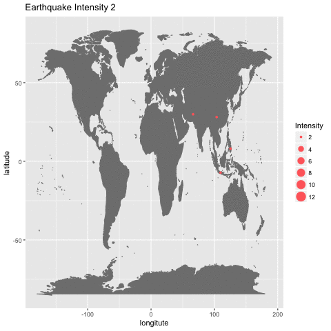

<div align="center">

</div>

> <p dir="RTL"> 
با استفاده از داده های زلزله ها در ایران و جهان به سوالات زیر پاسخ دهید.
</p>

***

<p dir="RTL">
بارگذاری داده ها و کتابخانه ها:
</p>

```{r, message=FALSE, warning=FALSE, comment=NA}
library(readr)
library(dplyr)
library(ggmap)
library(highcharter)
library(stringr)

earth_q <- read_rds("data/historical_web_data_26112015.rds")
```
***

<p dir="RTL">
۱. با استفاده از داده های
historical_web_data_26112015.rds 
و استفاده از نمودار پراکنش سه بعدی بسته plotly نمودار طول، عرض و عمق زلزله ها را رسم نمایید. علاوه بر آن بزرگی هر نقطه را برابر بزرگی زمین لرزه قرار دهید.
</p>

```{r, message=FALSE, warning=FALSE, comment=NA}
library(plotly)


p <- plot_ly(data = earth_q, x = ~Latitude, y = ~Longitude, z = ~Depth, size = ~Magnitude,
             marker = list(color = ~Magnitude, symbol = 'circle', sizemode = 'diameter', colorscale = c('#FFE1A1', '#683531'), showscale = TRUE), sizes = c(0.5, 7.8),
             text = ~paste('Province:', Province, '<br>City:', City, '<br>Magnitude:', Magnitude)) %>%
  add_markers() %>%
  layout(scene = list(title = 'Iran Earthquakes between Sep. to Nov. 2015',
                      xaxis = list(title = 'Latitude', range = c(23, 40)),
                      yaxis = list(title = 'Longitude', range = c(40, 71)),
                      zaxis = list(title = 'Depth', range = c(0, 162))))
p
```

***

<p dir="RTL">
۲. پویانمایی سونامی های تاریخی را بر حسب شدت بر روی نقشه زمین رسم نمایید.(از داده زلزله های بزرگ استفاده نمایید.)
</p>

<p dir="RTL">
برای این سوال از داده های بزرگ استفاده می کنیم، سپس مقادیر نامعلوم را داده حذف کرده و بر اساس مقادیر شدت، نمودار را رسم می کنیم.
</p>

```{r, message=FALSE, warning=FALSE, comment=NA, eval=FALSE}
library(gganimate)

disaster = read_delim("data/disaster.txt", "\t", escape_double = FALSE, trim_ws = TRUE) %>% 
  rename(lat = LATITUDE,long = LONGITUDE, magnit = INTENSITY,name = COUNTRY,year = YEAR) %>% 
  dplyr::select(lat, long, magnit, name, year)

nadis <- na.omit(disaster) %>% arrange(-magnit)
mapWorld <- borders("world", colour="gray50", fill="gray50") # create a layer of borders

p <- ggplot() + xlab("longitute") + ylab("latitude") + mapWorld + ggtitle("Earthquake Intensity")
p <- p + geom_point(aes(x = nadis$long, y = nadis$lat, size = nadis$magnit, frame = nadis$magnit), color="indianred1") + guides(size=guide_legend(title="Intensity"))
gganimate(p)

animation <- gganimate(p, "images/eq.gif")
```

<div align="center">

</div>

***

<p dir="RTL">
۳. نمودار چگالی دو بعدی زلزله های تاریخی ایران را رسم کنید.( از داده iran_earthquake.rds و لایه stat_density_2d استفاده نمایید).
</p>

<p dir="RTL">
برای حل این سوال ابتدا یک داده ی  پرت را که خارج از ایران بود حذف می کنیم. سپس نمودار چگالی را بر روی نقاط رخداد زلزله می کشیم.
</p>

```{r, message=FALSE, warning=FALSE, comment=NA}
iran_eq <- read_rds("data/iran_earthquake.rds")%>% arrange(-Long)
iran_eq = iran_eq[-c(1),]

p <- ggplot(iran_eq, aes(x=Long, y=Lat)) +
  geom_point() + stat_density_2d(aes(fill = ..level..), geom = "polygon") +
  xlab("Longitude") + ylab("Latitude") + 
  guides(fill=guide_legend(title="Density")) + 
  scale_fill_distiller(palette=4, direction=-1) +
  scale_x_continuous(expand = c(0, 0)) +
  scale_y_continuous(expand = c(0, 0)) +
  ggtitle("Iran Earthquakes Density Plot")
p
```

***

<p dir="RTL">
۴. احتمال اینکه در ایران در پنج سال آینده زلزله به بزرگی هفت ریشتر رخ دهد را محاسبه کنید. (از احتمال شرطی استفاده کنید.)
</p>

<p dir="RTL">
برای حل این سوال، ابتدا از داده ی
disaster 
زلزله های بیشتر از ۷ ریشتر در ایران را بدست می آوریم. سپس بر اساس سال مرتب کرده و فاصله ی هر دو زلزله ی متوالی را بدست می آوریم. در نهایت 
emperical CDF 
را برای این داده ها محاسبه می کنیم. آخرین زلزله ی ایران در سال ۲۰۱۷ رخ داده است. پس احتمال شرطی این سوال برابر است با احتمال رخ دادن زلزله در ۵ سال آتی، به شرط آنکه یک سال از آخرین زلزله گذشته باشد. بنا به فرمول احتمال شرطی، این احتمال با احتمال آنکه زلزله در فاصله ی ۶ ساله رخ داده باشد تقسیم بر عدم رخداد زلزله در فاصله ی یک ساله برابر است.
</p>

```{r, message=FALSE, warning=FALSE, comment=NA}
iran_sig_eq <- read_delim("data/disaster.txt", "\t", escape_double = FALSE, trim_ws = TRUE) %>% 
  rename(lat = LATITUDE,long = LONGITUDE, magnit = INTENSITY,name = COUNTRY,year = YEAR) %>% 
  dplyr::select(lat, long, magnit, name, year) %>% filter(magnit >= 7 & name == 'IRAN') %>% arrange(year) %>% 
  mutate(diff = year - lag(year))

cdf_iran <- ecdf(iran_sig_eq$diff)
summary(cdf_iran)

B = 1 - cdf_iran(1)
AB = cdf_iran(6)
p = (AB)/(B)

cat("Probability of earthquake in 5 years is", p)
```

***

<p dir="RTL">
۵. بر اساس داده های زلزله های بزرگ ابتدا تعداد و متوسط کشته زلزله ها را بر حسب کشور استخراج نمایید. سپس نمودار گرمایی تعداد کشته ها را بر روی کره زمین رسم نمایید.(مانند مثال زیر!)
</p>

<div align="center">

</div>

<p dir="RTL">
برای حل این سوال ابتدا داده های 
NA 
را حذف می کنیم، سپس میانگین و مجموع تلفات زلزله ها را بدست می آوریم. برای نمایش کشورها بر روی نقشه نیاز است که نام کشورها را به نام کوتاه استاندارد آن ها تبدیل کنیم. به همین دلیل از کتابخانه ی 
countrycode 
استفاده می کنیم. سپس نمودار گرمایی را یک بار برای تعداد کشته ها و یک بار برای میانگین تعداد کشته ها توسط کتابخانه ی 
rworldmap 
می کشیم.
</p>

```{r, message=FALSE, warning=FALSE, comment=NA}
library(rworldmap)
library(countrycode)

disaster_sum <- read_delim("data/disaster.txt", "\t", escape_double = FALSE, trim_ws = TRUE) %>% 
  rename(lat = LATITUDE,long = LONGITUDE, magnit = INTENSITY,country = COUNTRY,year = YEAR, death=TOTAL_DEATHS) %>% 
  dplyr::select(lat, long, magnit, country, year, death)

disaster_sum = na.omit(disaster_sum)
disaster_sum <- disaster_sum %>% group_by(country) %>% summarise(fatality_sum = sum(death), fatality_mean = mean(death))

disaster_sum$country <- countrycode(disaster_sum$country, "country.name", "iso3c", warn = TRUE, nomatch = NA,
                                    custom_dict = NULL, custom_match = NULL, origin_regex = FALSE)

knitr::kable(disaster_sum %>% arrange(-fatality_sum))

heatMap <- joinCountryData2Map(disaster_sum, joinCode = "ISO3",
                              nameJoinColumn = "country")

mapCountryData(heatMap, nameColumnToPlot = "fatality_sum", 
               mapTitle="Earthquakes total fatality", oceanCol=gray(0.3),
               colourPalette=c("cadetblue1","cadetblue3", "deepskyblue2", "deepskyblue3", "deepskyblue4", "dodgerblue4", "navy"), missingCountryCol = "white")


heatMap <- joinCountryData2Map(disaster_sum, joinCode = "ISO3",
                               nameJoinColumn = "country")

mapCountryData(heatMap, nameColumnToPlot = "fatality_mean", 
               mapTitle="Earthquakes fatality rate", oceanCol=gray(0.3),
               colourPalette=c("cadetblue1","cadetblue3", "deepskyblue2", "deepskyblue3", "deepskyblue4", "dodgerblue4", "navy"), missingCountryCol = "white")
```

***

<p dir="RTL">
۶. با استفاده از داده لرزه های بزرگ و به وسیله طول، عرض، شدت، عمق مدلی برای پیش بینی تعداد کشته های زلزله بیابید.
</p>

<p dir="RTL">
برای مدلسازی از 
glm 
استفاده می کنیم. به علت آنکه توزیع ما توزیع پسین حاشیه ای دارد که نشان می دهد واریانس توزیع نرمال نامعلوم است، از خانواده ی 
inverse gamma 
استفاده می کنیم.
</p>

```{r, message=FALSE, warning=FALSE, comment=NA}
disaster_death <- read_delim("data/disaster.txt", "\t", escape_double = FALSE, trim_ws = TRUE) %>% 
  rename(lat = LATITUDE,long = LONGITUDE, magnit = INTENSITY, depth = FOCAL_DEPTH, country = COUNTRY,year = YEAR, death=TOTAL_DEATHS) %>% 
  dplyr::select(lat, long, magnit, depth, country, year, death)

# generalized regression model
glm_model <- glm(death ~ lat + long + magnit + depth, family = Gamma(link = "inverse"), data = disaster_death)
summary(glm_model)

glm_model <- glm(death ~ magnit + depth, family = Gamma(link = "inverse"), data = disaster_death)
summary(glm_model)

cat("Test GLM model using null and model deviances: ",1-pchisq(3965.6 - 3409.4, df=(429 - 427)))
```

<p dir="RTL">
مشاهده می کنیم که متغیر های طول و عرض جغرافیای تاثیری ندارند و عمق و شدت زلزله تاثیر زیادی بر روی تعداد کشته ها دارد. هم چنین با توجه به خروجی مشاهده می کنیم که خطای ما حول ۲ است. از طرفی آخرین خروجی به ما نشان می دهد که مدل ما از مدل
intercept-only 
بهتر عملکرد و فرض صفر که یکسان بودن این مدل است باطل است.
</p>

***

<p dir="RTL">
۷. با استفاده از داده worldwide.csv به چند سوال زیر پاسخ دهید. تحقیق کنید آیا می توان از پیش لرزه، زلزله اصلی را پیش بینی کرد؟
</p>

<p dir="RTL">
برای حل این سوال، ابتدا از روی زمان زلزله، سال و ماه و روز وقوع زلزله را بدست می آوریم. سپس از روی محل وقوع زلزله، ناحیه ی وقوع زلزله(همانند کشور یا ایالت) را بدست می آوریم. سپس در نظر میگیریم که زلزله هایی که در یک محل و در یک ماه رخ می دهند، به یکدیگر مربوط هستند.(البته این روش خطایی برای زلزله های میان ماه ها دارد.) سپس باید پیش لرزه، پس لرزه و زلزله ی اصلی را تعیین کنیم. برای این موضوع زلزله ای که بیشتر شدت را دارد زلزله ی اصلی در نظر میگیریم. برای پیاده سازی این موضوع، بر اساس ناحیه و سال و ماه گروه بندی کرده و سپس شدت بیشترین زلزله و زمان وقوع آن را بدست می آوریم. حال اگر زلزله ای شدت کمتری از زلزله ی اصلی داشته باشد و پیش از زلزله ی اصلی رخ دهد، پیش لرزه است و اگر شدت کمتری از زلزله ی اصلی داشته باشد و پس از زلزله ی اصلی رخ دهد پس لرزه است.(در کد به پیش لرزه عدد ۱ و به پس لرزه عدد ۱- نسبت می دهیم.) در نهایت نیز احتمال اینکه زلزله ی اصلی، پیش لرزه ای داشته باشد را محاسبه می کنیم.
</p>

```{r, message=FALSE, warning=FALSE, comment=NA}
worldwide <- read_csv("data/worldwide.csv")

worldwide <- worldwide %>% mutate(year = as.numeric(format(time, format = "%Y")), 
         month = as.numeric(format(time, format = "%m")), 
         day = as.numeric(format(time, format = "%d")))

x <- str_split_fixed(worldwide$place, ",", 2) %>% as.data.frame(stringsAsFactors = F)
colnames(x) = c("", "location")
x <- x %>% select(location)

worldwide <- bind_cols(worldwide, x)

worldwide_fore <- worldwide %>% filter(location != "") %>% 
  select(time, year, month, day, latitude, longitude, depth, mag, location) %>% 
  group_by(year, month, location) %>% arrange(time) %>% 
  mutate(max_mag = max(mag))

x <- worldwide_fore %>% filter(mag == max_mag)
x$max_time <- x$time

s <- worldwide_fore %>% filter(mag != max_mag)
s <- s %>% full_join(x, by = c("max_mag", "month", "year", "location")) %>% 
  select(time = time.x, year, month, day = day.x, latitude = latitude.x, longitude = longitude.x,
         depth = depth.x, mag = mag.x, location,max_mag, max_time = time.y)

worldwide_fore_aft <- bind_rows(x, s) %>% filter(!is.na(time)) %>% 
  mutate(diff = as.numeric(max_time - time, units="days"),
         state = ifelse(diff > 0, 1, ifelse(
           diff == 0, 0, -1
         )))

prob = nrow(worldwide_fore_aft %>% filter(state == 1) %>% 
              distinct(year, month, location))/
  nrow(worldwide_fore_aft %>% distinct(year, month, location))

cat("Probability of happening earthquake after foreshock is:", prob)
```

<p dir="RTL">
همانطور که در نتیجه ی بالا می بینیم، در ۵۸ درصد مواقع پیش از زلزله ی اصلی، پیش لرزه رخ می دهد. از آنجایی که این احتمال بالا نیست، نمی توان با قطعیت گفت که زلزله ای که رخ داده پیش لرزه است و حتما زلزله ی اصلی را به همراه دارد.
</p>

***

<p dir="RTL">
۸. گزاره " آیا شدت زلزله به عمق آن بستگی دارد" را تحقیق کنید؟ (طبیعتا از آزمون فرض باید استفاده کنید.)
</p>

<p dir="RTL">
برای این سوال از تست کوریلیشن و تست استقلال 
chi 
استفاده می کنیم.
</p>

```{r, message=FALSE, warning=FALSE, comment=NA}
cor.test(worldwide$depth, worldwide$mag, method = 'spearman')

eq_matrix <- worldwide %>% select(depth, mag) %>% filter(depth > 0) %>% as.matrix() 

chisq.test(eq_matrix)
```

<p dir="RTL">
در تست کوریلیشن مشاهده می کنیم که احتمال اینکه این دو متغیر از دو توزیع غیرمرتبط آمده باشند، صفر است. پس فرض صفر باطل است و این دو متغیر به یکدیگر وابسته هستند. همچنین در تست استقلال نیز مشاهده می کنیم که احتمال استقلال دو متغیر بسیار کم بوده و در نتیجه فرض صفر باطل است و این دو متغیر از یکدیگر مستقل نیستند. پس فرض عدم ارتباط عمق و شدت زلزله رد می شود.
</p>

***

<p dir="RTL"> 
۹. میانگین سالانه زلزله ها را بر حسب کشور به دست آورید. آیا میتوان دلیلی در تایید یا رد تئوری هارپ ارائه کرد.
</p>

<p dir="RTL">
برای حل این سوال، ابتدا می بایست کشور محل رخداد زلزله را بدست بیاوریم. برای این کار از نقاط نقشه ی 
rworldmap 
استفاده می کنیم. سپس بر اسا کشور و سال گروهبندی کرده و تعداد زلزله ها و میانگین شدت زلزله ها را بدست می آوریم. در نهایت نمودار موزاییک زلزله ها را نمایش می دهیم.
</p>

```{r, message=FALSE, warning=FALSE, comment=NA}
library(sp)

coords2country = function(points)
{  
  countriesSP <- getMap(resolution='high')
  
  #setting CRS directly to that from rworldmap
  pointsSP = SpatialPoints(points, proj4string=CRS(proj4string(countriesSP)))  
  # use 'over' to get indices of the Polygons object containing each point 
  indices = over(pointsSP, countriesSP)
  
  indices$ISO3 # returns the ISO3 code 
}

s <- worldwide %>% select(longitude, latitude)
s$country <- coords2country(s)
s <- s %>% select(country)

worldwide <- bind_cols(worldwide, s)

worldwide <- worldwide %>% filter(!is.na(country)) %>% 
  mutate(year = as.numeric(format(time, format = "%Y")))

worldwide_sum <- worldwide %>% group_by(year, country) %>% 
  summarise(count = n(), mean_mag = mean(mag), mean_depth = mean(depth))

hchart(worldwide_sum %>% filter(year == 2015), "treemap", hcaes(x = country, value = count, color = mean_mag)) %>% 
  hc_title(text = "2015 Earthquakes", style = list(fontWeight = "bold"))

hchart(worldwide_sum %>% filter(year == 2016), "treemap", hcaes(x = country, value = count, color = mean_mag)) %>% 
  hc_title(text = "2016 Earthquakes", style = list(fontWeight = "bold"))

hchart(worldwide_sum %>% filter(year == 2017), "treemap", hcaes(x = country, value = count, color = mean_mag)) %>% 
  hc_title(text = "2017 Earthquakes", style = list(fontWeight = "bold"))

hchart(worldwide_sum %>% filter(year == 2018), "treemap", hcaes(x = country, value = count, color = mean_mag)) %>% 
  hc_title(text = "2018 Earthquakes", style = list(fontWeight = "bold"))
```

<p dir="RTL">
پروژه ی هارپ از سال ۲۰۱۵ منحل شده است. در صورتی که این پروژه تاثیر زیادی بر روی زلزله داشته باشد، می بایست پس از توقف آن با تغییر الگوی زلزله مواجه باشیم. اما مشاهده می کنیم که تغییری در الگوی زلزله خیزی کشورها بوجود نیامده است. در نتیجه نمی توانیم در مورد تاثیر پروژه ی هارپ نظر خاصی بدهیم.
</p>

***

<p dir="RTL"> 
۱۰. سه حقیقت جالب در مورد زلزله بیابید.
</p>


<p dir="RTL">
**زلزله خیزی قاره های مختلف**
<br>
برای این بخش، قاره های مختلف را از نظر میانگین شدت زلزله و تعداد زلزله ها مقایسه می کنیم.
</p>

```{r, message=FALSE, warning=FALSE, comment=NA}
# a continents difference in earthquake magnitude
coords2continent = function(points)
{  
  countriesSP <- getMap(resolution='high')
  pointsSP = SpatialPoints(points, proj4string=CRS(proj4string(countriesSP)))  

  indices = over(pointsSP, countriesSP)
  indices$REGION   # returns the continent (7 continent model)
}

disaster_ten <- disaster_death %>% filter(!is.na(long) & !is.na(lat))
s <- disaster_ten %>% select(long, lat)
s$continent <- as.character(coords2continent(s))
s <- s %>% select(continent)

disaster_ten <- bind_cols(disaster_ten, s)

disaster_ten_sun <- disaster_ten %>% group_by(continent) %>% filter(!is.na(continent) & !is.na(death) & !is.na(magnit)) %>% 
  summarise(count = n(), fatality = sum(death), mean_fatality = mean(death), mean_mag = mean(magnit))

disaster_ten_sun[3,1] = "Oceania"
disaster_ten_sun[6,1] = "South America"

hchart(disaster_ten_sun, "treemap", hcaes(x = continent, value = mean_mag, color = count)) %>% 
  hc_title(text = "Difference in Signifact Earthquakes Occurance in Continents", style = list(fontWeight = "bold"))

```

<p dir="RTL">
همانطور که مشاهده می کنیم، شدت زلزله در قاره های مختلف با یکدیگر تفاوت محسوسی ندارد، اما تعداد زلزله های شدید در آسیا بسیار بیشتر است.
</p>

<p dir="RTL">
**خطرناک ترین قاره ها از نظر زلزله**
<br>
برای این سوال میزان کشته ها و میانگین کشته های زلزله ها را در هر قاره مشاهده می کنیم.
</p>

```{r, message=FALSE, warning=FALSE, comment=NA}
# b continents fatality
hcmap("custom/world-continents", data = disaster_ten_sun, value = "fatality",
      joinBy = c("name", "continent"), name = "Continents Total Fatality",
      dataLabels = list(enabled = TRUE, format = '{point.name}'),
      borderColor = "#FAFAFA", borderWidth = 0.1,
      tooltip = list(valueDecimals = 2)) %>% 
  hc_title(text = "Continents Total Fatality", style = list(fontWeight = "bold"))

hcmap("custom/world-continents", data = disaster_ten_sun, value = "mean_fatality",
      joinBy = c("name", "continent"), name = "Continents Mean Fatality",
      dataLabels = list(enabled = TRUE, format = '{point.name}'),
      borderColor = "#FAFAFA", borderWidth = 0.1,
      tooltip = list(valueDecimals = 2)) %>% 
  hc_title(text = "Continents Fatality Average", style = list(fontWeight = "bold"))
```

<p dir="RTL">
مشاهده می کنیم که آز آنجا که در آسیا جمعیت بیشتری زندگی می کند و تعداد زلزله های خطرناک بیشتری نسبت به سایر قاره ها دارد، میزان کشته های آن نیز بسیار زیاد است و خطرناک ترین قاره برای زندگی به شمار می آید.
</p>

<p dir="RTL">
**بررسی استان های زلزله خیز ایران**
<br>
در این سوال، میانگین شدت زلزله های استان های ایران را بررسی می کنیم.
</p>

```{r, message=FALSE, warning=FALSE, comment=NA}
# c Iran earthquakes
earth_q_sum <- earth_q %>% as.data.frame(stringsAsFactors = F)

earth_q_sum$Province = as.character(earth_q_sum$Province)
earth_q_sum$Province[earth_q_sum$Province == "semnan"] = as.character("Semnan")
  
earth_q_sum <- earth_q_sum %>% group_by(Province) %>% filter(!is.na(Magnitude)) %>% summarise(mean_mag = mean(Magnitude)) %>% 
  arrange(Province)

earth_q_sum <- earth_q_sum[-c(1,4,5,15,27,34,35), ]
earth_q_sum[4,1] = as.character("Chahar Mahall and Bakhtiari")
earth_q_sum[12,1] = as.character("Esfahan")
earth_q_sum[9,1] = as.character("Hamadan")
earth_q_sum[13,1] = as.character("Kerman")
earth_q_sum[15,1] = as.character("Razavi Khorasan")
earth_q_sum[17,1] = as.character("Kohgiluyeh and Buyer Ahmad")
earth_q_sum[26,1] = as.character("Sistan and Baluchestan")

s <- c(NA, 0)
names(s)<-c("Province","mean_mag")
earth_q_sum <- rbind(earth_q_sum, s)

hcmap("countries/ir/ir-all", data = earth_q_sum, value = "mean_mag",
      joinBy = c("name", "Province"), name = "Iran Earthquakes",
      dataLabels = list(enabled = TRUE, format = '{point.name}'),
      borderColor = "#FAFAFA", borderWidth = 0.1) %>% 
  hc_title(text = "Iran Earthquake Magnitude Average", style = list(fontWeight = "bold"))
```

<p dir="RTL">
همانطور که می بینیم، استان های جنوبی ایران زلزله خیزتر از سایر استان ها هستند.
</p>