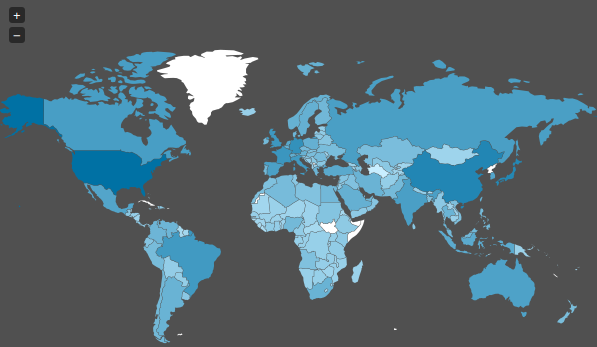

> 
 
با استفاده از داده های زلزله ها در ایران و جهان به سوالات زیر پاسخ دهید.

***

۱. با استفاده از داده های
historical_web_data_26112015.rds 
و استفاده از نمودار پراکنش سه بعدی بسته plotly نمودار طول، عرض و عمق زلزله ها را رسم نمایید. علاوه بر آن بزرگی هر نقطه را برابر بزرگی زمین لرزه قرار دهید.

***

۲. پویانمایی سونامی های تاریخی را بر حسب شدت بر روی نقشه زمین رسم نمایید.(از داده زلزله های بزرگ استفاده نمایید.)

***

۳. نمودار چگالی دو بعدی زلزله های تاریخی ایران را رسم کنید.( از داده iran_earthquake.rds و لایه stat_density_2d استفاده نمایید).

***

۴. احتمال اینکه در ایران در پنج سال آینده زلزله به بزرگی هفت ریشتر رخ دهد را محاسبه کنید. (از احتمال شرطی استفاده کنید.)

***

۵. بر اساس داده های زلزله های بزرگ ابتدا تعداد و متوسط کشته زلزله ها را بر حسب کشور استخراج نمایید. سپس نمودار گرمایی تعداد کشته ها را بر روی کره زمین رسم نمایید.(مانند مثال زیر!)

***

۶. با استفاده از داده لرزه های بزرگ و به وسیله طول، عرض، شدت، عمق مدلی برای پیش بینی تعداد کشته های زلزله بیابید.

***

۷. با استفاده از داده worldwide.csv به چند سوال زیر پاسخ دهید. تحقیق کنید آیا می توان از پیش لرزه، زلزله اصلی را پیش بینی کرد؟

***

۸. گزاره " آیا شدت زلزله به عمق آن بستگی دارد" را تحقیق کنید؟ (طبیعتا از آزمون فرض باید استفاده کنید.)

***

 
۹. میانگین سالانه زلزله ها را بر حسب کشور به دست آورید. آیا میتوان دلیلی در تایید یا رد تئوری هارپ ارائه کرد.

***

 
۱۰. سه حقیقت جالب در مورد زلزله بیابید.

