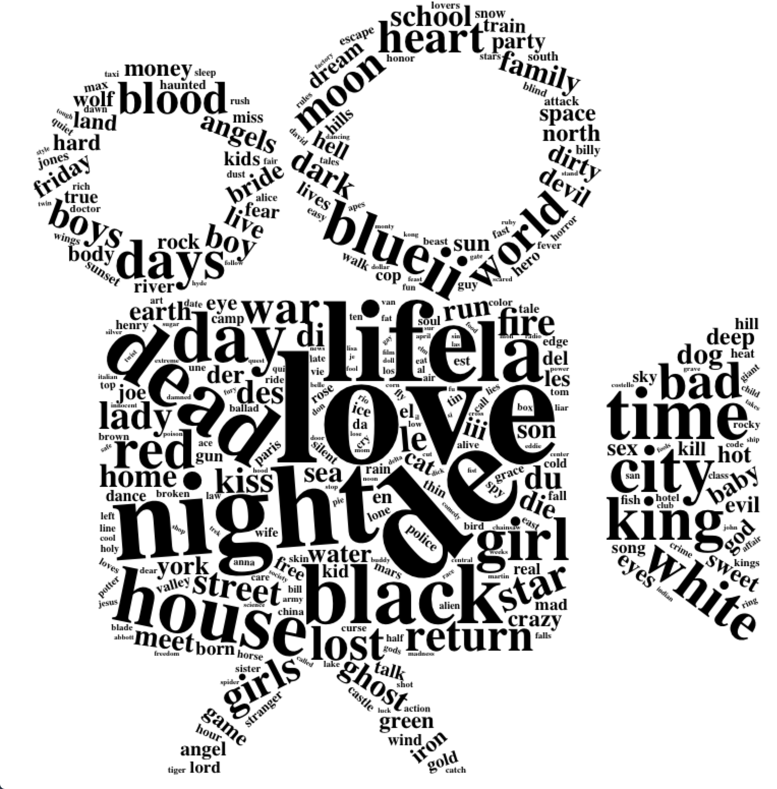

<div align="center">

</div>

> <p dir="RTL"> 
با استفاده از داده نظرهای فیلم به سوالات زیر پاسخ دهید.
</p>

***
<p dir="RTL">
بارگذاری داده ها و کتابخانه ها:
</p>

```{r, message=FALSE, warning=FALSE, comment=NA}
library(readr)
library(dplyr)
library(ggplot2)
library(highcharter)
library(stringr)

# Movies
movie = read_delim('data/ml-10M100K/movies.dat',delim = "::" ,col_names = c("MovieID",NA,"Title",NA,"Genres"))
movie = movie %>% select(1,3,5) 

# Tags
tag = read_delim('data/ml-10M100K/tags.dat',delim = "::" ,col_names = c("UserID",NA,"MovieID",NA,"Tag",NA,"Timestamp"))
tag = tag %>% select(1,3,5,7) 

# Ratings
rating = read_delim('data/ml-10M100K/ratings.dat',delim = "::" ,col_names = c("UserID",NA,"MovieID",NA,"Rating",NA,"Timestamp"))
rating = rating %>% select(1,3,5,7) 
```

```{r, message=FALSE, warning=FALSE, comment=NA}

```

<p dir="RTL">

</p>

***

<p dir="RTL">
۱. آماره های زیر را بیابید.
<br>
**الف. محبوب ترین فیلم کدام است؟**
<br>
محبوب ترین فیلم را فیلمی در نظر میگیریم که بیشتر از ۱۰۰۰ نفر آن را دیده باشند و در عین حال
rating 
بالایی نیز داشته باشد.
</p>

```{r, message=FALSE, warning=FALSE, comment=NA}
# a: best rated movie
best_rate <- rating %>% filter(!is.na(Rating)) %>% 
  group_by(MovieID) %>% summarise(Rate = mean(Rating), watch = n()) %>% 
  filter(watch > 1000) %>% arrange(desc(Rate)) %>% 
  left_join(movie, by = c("MovieID")) %>% 
  slice(1:10)

knitr::kable(best_rate)
```

<p dir="RTL">
**ب. بیشترین نظرات درباره چه فیلمی داده شده است؟**
<br>
</p>

```{r, message=FALSE, warning=FALSE, comment=NA}
# b: most reviewed movie
most_rev <- tag %>% filter(!is.na(MovieID)) %>%
  group_by(MovieID) %>% 
  summarise(Review = n()) %>% 
  arrange(desc(Review)) %>% 
  left_join(movie, by = c("MovieID")) %>% 
  slice(1:10)

knitr::kable(most_rev)
```

<p dir="RTL">
**پ. منفورترین فیلم کدام است؟**
<br>
منفورترین فیلم را فیلمی در نظر میگیریم که بیشتر از ۵۰۰ نفر آن را دیده باشند و در عین حال 
rating
بسیار کمی داشته باشد.
</p>

```{r, message=FALSE, warning=FALSE, comment=NA}
# c: most hated movie
worst_rate <- rating %>% filter(!is.na(Rating)) %>% 
  group_by(MovieID) %>% summarise(Rate = mean(Rating), watch = n()) %>% 
  filter(watch > 500) %>% arrange(Rate) %>% 
  left_join(movie, by = c("MovieID")) %>% 
  slice(1:10)

knitr::kable(worst_rate)
```

<p dir="RTL">
**ت. تعداد فیلم های ساخته شده در هر سال**
<br>
برای حل این سوال می بایست ابتدا سال فیلم را از طریق 
regex 
بدست بیاوریم و سپس بر اساس سال گروه بندی کنیم و نمودار را بکشیم.
</p>

```{r, message=FALSE, warning=FALSE, comment=NA}
# d: yearly built movies
movie <- movie %>% mutate(year = str_extract(Title, '\\([[:digit:]]{4}\\)'))
yearly <- movie %>% group_by(year) %>% summarise(count = n()) %>% filter(!is.na(year))

yearly  %>% mutate(year = str_extract(year, '[[:digit:]]{4}')) %>% 
  hchart(type = "line", hcaes(x = year, y = count)) %>% 
  hc_yAxis(title = list(text = "Count")) %>% 
  hc_xAxis(title = list(text = "Year")) %>% 
  hc_title(text = "Number of Movie Produced Yearly", style = list(fontWeight = "bold")) %>% 
  hc_add_theme(hc_theme_sandsignika())
```

<p dir="RTL">
**ث. در هر سالی مردم به چه ژانری علاقه مند بوده اند.**
<br>
برای حل این سوال ابتدا ژانر هر فیلم را بدست می آوریم. برای این منظور، ابتدا تمامی ژانرهای ممکن را استخراج کرده و آن را تبدیل به ستون می کنیم. حال در صورتی که فیلمی در این ژانر باشد مقدار آن ستون را برابر با یک قرار می دهیم. سپس 
rating 
هر فیلم را نیز به این داده اضافه می کنیم. در نهایت در هر سال فیلم هایی که بیشتر از ۱۰۰ نفر آن را دیده باشند و امتیاز بالای ۳ داشته باشند را به عنوان فیلم های محبوب مردم در نظر میگیریم. در انتها می بایست ژانری که بیشترین فیلم مورد علاقه دارد را بدست آوریم که برای این کار ابتدا بر اساس سال گروه بندی کرده و سپس مجموع ستون های ژانرها را حساب می کنیم و ژانری که بیشترین مجموع را داشته باشد، بیشترین فیلم محبوب را در خود جا داده و در نتیجه محبوب ترین ژانر حساب می شود.
</p>

```{r, message=FALSE, warning=FALSE, comment=NA}
# e: favourite genre

# extract genre for each movie
movie_genre <- movie
movie_genre$Action = 0
movie_genre$Adventure = 0
movie_genre$Animation = 0
movie_genre$Children = 0
movie_genre$Comedy = 0
movie_genre$Crime = 0
movie_genre$Documentary = 0
movie_genre$Drama = 0
movie_genre$Fantasy = 0
movie_genre$`Film-Noir` = 0
movie_genre$Horror = 0
movie_genre$Musical = 0
movie_genre$Mystery = 0
movie_genre$Romance = 0
movie_genre$`Sci-Fi` = 0
movie_genre$Thriller = 0
movie_genre$War = 0
movie_genre$Western = 0

movie_genre <- movie_genre %>% 
  mutate(Action = ifelse(str_detect(Genres, 'Action'),1,0),
         Adventure = ifelse(str_detect(Genres, 'Adventure'),1,0),
         Animation = ifelse(str_detect(Genres, 'Animation'),1,0),
         Children = ifelse(str_detect(Genres, 'Children'),1,0),
         Comedy = ifelse(str_detect(Genres, 'Comedy'),1,0),
         Crime = ifelse(str_detect(Genres, 'Crime'),1,0),
         Documentary = ifelse(str_detect(Genres, 'Documentary'),1,0),
         Drama = ifelse(str_detect(Genres, 'Drama'),1,0),
         Fantasy = ifelse(str_detect(Genres, 'Fantasy'),1,0),
         `Film-Noir` = ifelse(str_detect(Genres, 'Film-Noir'),1,0),
         Horror = ifelse(str_detect(Genres, 'Horror'),1,0),
         Musical = ifelse(str_detect(Genres, 'Musical'),1,0),
         Mystery = ifelse(str_detect(Genres, 'Mystery'),1,0),
         Romance = ifelse(str_detect(Genres, 'Romance'),1,0),
         `Sci-Fi` = ifelse(str_detect(Genres, 'Sci-Fi'),1,0),
         Thriller = ifelse(str_detect(Genres, 'Thriller'),1,0),
         War = ifelse(str_detect(Genres, 'War'),1,0),
         Western = ifelse(str_detect(Genres, 'Western'),1,0))
movie_genre <- na.omit(movie_genre)

movie_genre <- rating %>% filter(!is.na(Rating)) %>% 
  group_by(MovieID) %>% summarise(Rate = mean(Rating), watch = n()) %>% 
  left_join(movie_genre, by = c("MovieID"))
movie_genre <- na.omit(movie_genre)

yearly_genre <- movie_genre %>% filter(watch > 100 & Rate > 3) %>% 
  group_by(year) %>% summarise_at(c(7:23), sum)
yearly_genre <- na.omit(yearly_genre)

yearly_genre$chosen <- colnames(yearly_genre %>% 
                                  select(-year))[max.col(yearly_genre %>% 
                                                           select(-year),ties.method="first")]
knitr::kable(yearly_genre %>% select(year, chosen))

```

***

<p dir="RTL">
۲. ژانر فیلم ها را استخراج نمایید.  سپس آماره های زیر را استخراج نمایید.
<br>
این داده در بخش آخر سوال پیش با نام 
movie_genre 
طبق توضیحات داده ساخته شده است.
<br>
**الف. نمودار ستونی تعداد فیلم های هر ژانر**
<br>
برای این سوال ابتدا داده ی فوق را به صورت مجموع هر ستون خلاصه سازی می کنیم. در نهایت با کمک تابع
melt 
ستون های دیتافریم را تبدیل به ردیف می کنیم و نمودار را نمایش می دهیم.
</p>

```{r, message=FALSE, warning=FALSE, comment=NA}
library(reshape2)

# a: count of genre movies
count_genre <- movie_genre  %>% summarise_at(c(7:24), sum)
count_genre = melt(count_genre)
colnames(count_genre) = c('genre', 'count')

count_genre %>% 
  hchart(type = "column", hcaes(x = genre, y = count, color = count)) %>% 
  hc_yAxis(title = list(text = "Count")) %>% 
  hc_xAxis(title = list(text = "Genre")) %>% 
  hc_title(text = "Number of Movie Produced in Each Genre", style = list(fontWeight = "bold")) %>% 
  hc_add_theme(hc_theme_538())
```

<p dir="RTL">
**ب. نمودار همبستگی ژانرها**
<br>
</p>

```{r, message=FALSE, warning=FALSE, comment=NA}
# b: genres correlation plot
library(corrplot)
corrplot(cor(movie_genre  %>% select(c(7:24))), method = "color", tl.cex = 0.5/par("cex"), cl.cex = 0.5/par("cex"))
```

<p dir="RTL">
**پ. متوسط امتیاز به هر ژانر**
<br>
برای حل این سوال، ابتدا امتیاز فیلم در هر ژانر را برای آن ژانر قرار می دهیم. سپس مجموع ستون ها را بدست آورده و آن را تقسیم بر تعداد فیلم های ساخته شده در هر ژانر که در بخش الف بدست آوردیم می کنیم و میانگین امتیاز هر ژانر را بدست می آوریم. در نهایت نیز دیتافریم را به کمک 
melt 
از ستونی به سطری تبدیل می کنیم.
</p>

```{r, message=FALSE, warning=FALSE, comment=NA}
# c: average rating for genres
library(ggplot2)

rate_genre <- movie_genre %>% 
  mutate(Action = Rate*Action,
         Adventure = Rate*Adventure,
         Animation = Rate*Animation,
         Children = Rate*Children,
         Comedy = Rate*Comedy,
         Crime = Rate*Crime,
         Documentary = Rate*Documentary,
         Drama = Rate*Drama ,
         Fantasy = Rate*Fantasy,
         `Film-Noir` = Rate*`Film-Noir`,
         Horror = Rate*Horror,
         Musical = Rate*Musical,
         Mystery = Rate*Mystery,
         Romance = Rate*Romance,
         `Sci-Fi` = Rate*`Sci-Fi`,
         Thriller = Rate*Thriller,
         War = Rate*War,
         Western = Rate*Western)

rate_sum_genre <- rate_genre %>% summarise_at(c(7:24), sum)
count_genre <- movie_genre  %>% summarise_at(c(7:24), sum)

rate_mean_genre <- rate_sum_genre/count_genre
mrate_mean_genre = melt(rate_mean_genre)
colnames(mrate_mean_genre) = c('genre', 'mean')

p = ggplot(data = mrate_mean_genre, mapping = aes(x = genre, y = mean, fill = mean)) + 
  ggtitle("Genre Average Rating") + geom_bar(stat="identity") + 
  scale_fill_gradient(low="gold", high="darkgreen") + 
  theme(axis.text.x = element_text(angle = 45, hjust = 1))
p

knitr::kable(mrate_mean_genre)
```

<p dir="RTL">
**ت. دوران طلایی فیلم سازی** 
<br>
برای بدست آوردن دوران طلایی سینما، دهه ی هر فیلم را بدست آورده و بر اساس دهه گروه بندی کرده و دهه ای که بیشترین میانگین امتیاز را دارد را به عنوان دوران طلایی معرفی می کنیم.
</p>

```{r, message=FALSE, warning=FALSE, comment=NA}
# d: cinema golden age
movie_rate <- movie_genre %>% select(-c(7:24)) %>% 
  mutate(year = as.numeric(str_extract(year, '[[:digit:]]{4}'))) %>% 
  mutate(decade = year - (year %% 10)) %>% 
  group_by(decade) %>% summarise(watch_mean = mean(watch), watch = sum(watch), rate_mean = mean(Rate)) %>% 
  arrange(desc(rate_mean))

golden_age <- movie_rate %>% slice(1)
cat("Cinema Golden Age is", golden_age[1,1,1], "with rating mean of", golden_age[1,4,1])

movie_rate  %>% arrange(decade) %>% 
  hchart(type = "line", hcaes(x = decade, y = rate_mean)) %>% 
  hc_yAxis(title = list(text = "Average Rating")) %>% 
  hc_xAxis(title = list(text = "Decade")) %>% 
  hc_title(text = "Rating Average in Decades", style = list(fontWeight = "bold")) %>% 
  hc_add_theme(hc_theme_flat())
```

***

<p dir="RTL">
۳. نمودار ابر لغات را بر حسب کلمات عنوان فیلم ها رسم نمایید.
</p>

<p dir="RTL">
برای حل این سوال ابتدا زیرمجموعه ای از داده ی 
movies
که تنها شامل عنوان فیلم هاست میگیریم. سپس نشانه گذاری ها را حذف کرده و عناوین را به کمک
space 
تقسیم می کنیم. سپس فرکانس هر لغت را بدست می یابیم. در نهایت داده های غلط از جمله 
stopwords 
و سال ها و پرانتزها را حذف می کنیم و تصویر را به صورت یک دوربین فیلم برداری می کشیم.
</p>

```{r, message=FALSE, warning=FALSE, comment=NA, eval=FALSE}
library(wordcloud2)
library(tidytext)

title_data <- movie %>% select(text = Title) %>% mutate(text = str_to_lower(text)) %>% 
  str_replace_all("\"","") %>% 
  str_replace("[[:punct:]]", "") %>% 
  str_split(pattern = "\\s") %>% 
  unlist() %>% as.data.frame(stringsAsFactors = F) %>% 
  filter( . != "")
  

title_data <- title_data %>% table() %>% 
  as.data.frame(stringsAsFactors = F)

colnames(title_data) = c("word","count")

title_data <- title_data %>%
  filter(!word %in% stop_words$word) %>% 
  filter(str_length(word)>1) %>% 
  filter(!str_detect(word,"\\d")) %>%
  filter(!str_detect(word,"\\(")) %>%
  filter(!str_detect(word,"[[:punct:]]")) %>% 
  arrange(desc(count)) %>% 
  filter(count > 4) %>% 
  select(word, freq = count)

wordcloud2(title_data , figPath = "images/movie-projector.png" , size = 0.9, color = "black")
```

<div align="center">

</div>

***

<p dir="RTL">
۴. با استفاده از قوانین همبستگی یک توصیه گر برای فیلم ها بسازید. شبیه ترین فیلم ها به لیست زیر را پیدا کنید.
</p>

* Castle in the Sky (1986)
* Cast Away (2000)
* No Country for Old Men (2007)
* Memento (2000)

<p dir="RTL">

</p>

```{r, message=FALSE, warning=FALSE, comment=NA}

```

***

<p dir="RTL">
۵. تمرین سخت: در گیت هاب برای خود اکانت درست کنید. همه تمرین های خود را آنجا بارگذاری کنید! و لینک آن را ارسال نمایید.
</p>

***

<p dir="RTL">
۶. پنج انتقاد از درس و نحوه تدریس را بیان کنید.
</p>

***

<p dir="RTL">
۷. پنج پیشنهاد برای بهتر شدن درس بیان کنید.
</p>


***

<p dir="RTL">
۸. سه موضوع آماری جدید برای جایگزینی در سرفصل ها پیشنهاد دهید.
</p>

***

<p dir="RTL"> 
۹. سه داده جالب برای کار در کلاس پیشنهاد دهید.
</p>

***

<p dir="RTL"> 
۱۰. چهار نکته مهمی که در کلاس یاد گرفتید را بیان کنید.
</p>

